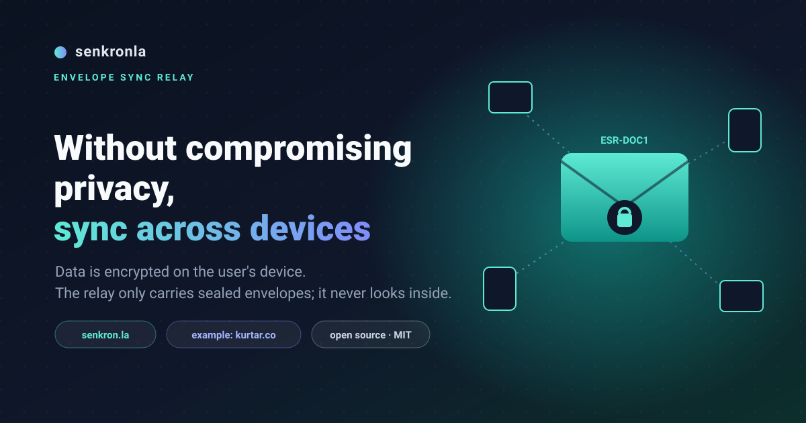
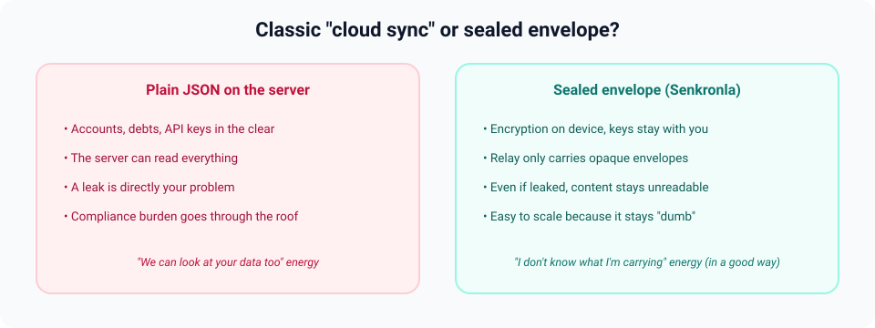
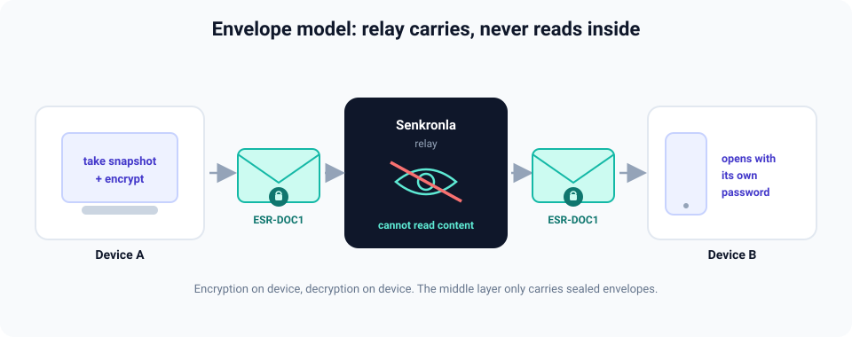
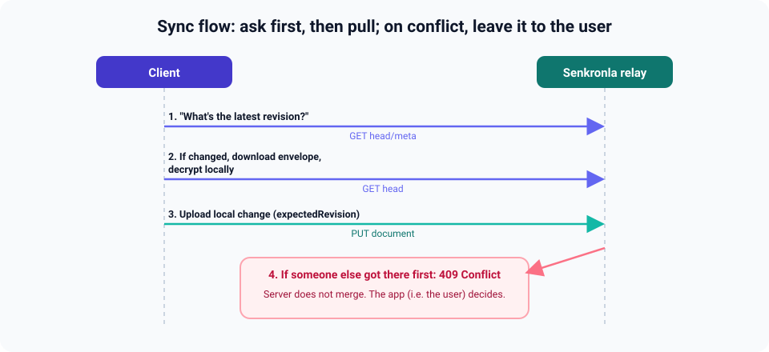
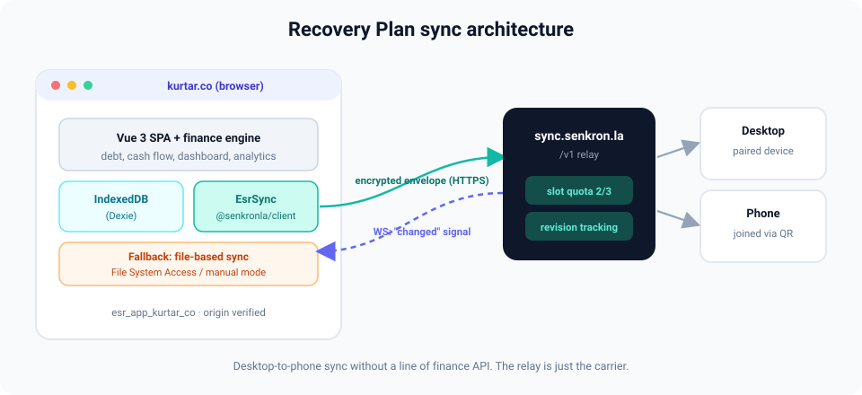
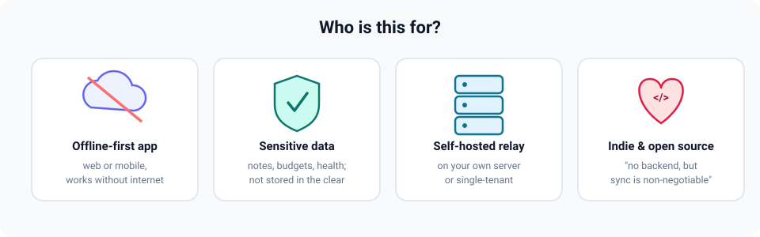
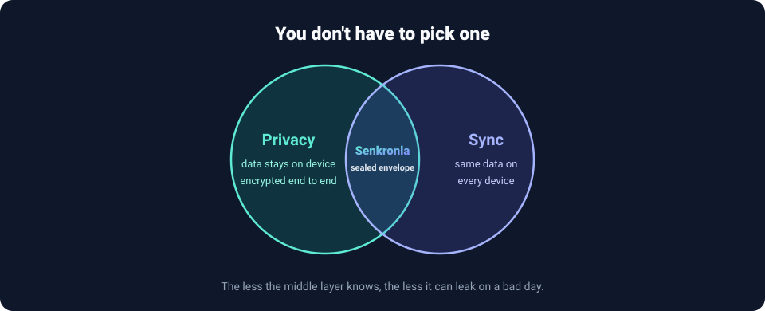
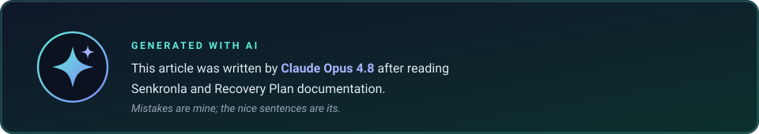

# Keeping data on the user's device while still solving cross-device sync: why I built Senkronla

It all started with a small, slightly stubborn sentence: "The user's debts, accounts, and income/expense history should stay on their device." I was building a personal finance app and I wasn't willing to compromise on that. I had no intention of piling data onto a server and keeping it there in plain sight.

But let's be honest — like everyone else, I want a record I enter on my phone in the morning to show up on my desktop in the evening. That's where the classic dilemma walks in: give up privacy, or give up sync. You can call me a spoiled user who wants both; I won't argue.

What do you find when you lift the lid on most "cloud sync"? Readable data on the server. Account balances, loan installments, sometimes an API key forgotten in a corner. If the transport layer (let's call it a relay) can read the content, the security and privacy of that data are entirely on your shoulders.

I wanted the opposite. The app should be the sole owner of its data; the layer in between should carry a sealed envelope without ever looking inside. That stubbornness became **Senkronla**.

## So what exactly is Senkronla?

Short answer: an open-source sync transport layer you can self-host. A bit more formally, Senkronla is an **Envelope Sync Relay**. The name sounds slightly too serious, I know — but the idea really is as simple as a postal envelope.

Picture this. Your app takes a snapshot, encrypts it on the device, and puts it into a sealed envelope in `ESR-DOC1` format. Senkronla receives that envelope, stores it, tracks which revision it is, manages device pairing and per-user device quotas, and when someone writes something new it tells other devices "hey, there's fresh content." But it never, under any circumstances, looks inside the envelope.

In the literature this is called zero-knowledge. I prefer "deliberate ignorance": the less the layer knows, the less it can leak on a bad day.

Let me be clear about this, because it's the most misunderstood part: Senkronla is not a "notes app backend" or a ready-made "finance API." Business logic, data model, encryption — all of that stays in the app. Senkronla only aspires to be that thin, quiet carrier. It should sound modest; it is.

Practical pointers:

- Website and docs: [senkron.la](https://senkron.la)
- Source: [github.com/kemalersin/senkronla](https://github.com/kemalersin/senkronla)
- Client SDK: [`@senkronla/client`](https://www.npmjs.com/package/@senkronla/client) (includes a handy facade called `EsrSync`, with offline queue and conflict callbacks)

You can run your own relay with Docker Compose or Node.js 22+. Communication goes over REST `/v1`, optionally WebSocket too. The WebSocket part works on a push-to-pull model: the server only nudges you with "something changed," and you still pull the actual data over HTTP. You get a real-time feel without traffic going off the rails.

## What do I mean by "envelope"?

In traditional sync, the server often plays the hero: "I have the truth, I'll handle the rest." The Envelope Sync Relay model politely flips that role. The flow looks roughly like this:

1. The client first asks via `GET head/meta`: "What's the latest revision remotely?"
2. If the revision changed, it downloads the envelope with `GET head` and opens it with its own password. The server doesn't know the password, so the ability to open the envelope stays entirely with the user.
3. If there's a local change, it sends a new envelope with `PUT`. Here `expectedRevision` provides optimistic concurrency: "I last saw revision X — is it still that?"
4. If another device slipped in and changed the revision, the server returns `409 Conflict`. The important part: the server doesn't resolve conflicts on its own; it leaves the decision to the app's UI — which means the user.

That last point was non-negotiable for me. When you're dealing with sensitive finance data, few things are scarier than "the server auto-merged and quietly overwrote something." In Senkronla, merge decisions are yours; the server just raises its hand and says "there's a conflict here." You can scale the relay comfortably because there's no complex business logic or decryption running there. All of that load stays in the app, where it belongs.

The operator side isn't empty either. You can hold multiple documents under one namespace (e.g. separate `primary` and `settings`), device pairing and recovery-phrase flows are ready, slot licensing limits device count, and app registry lets you verify which origins may connect. It's all in the docs and the operator portal.

## From theory to the field: Recovery Plan

Confession time: I only believe something really works once I've used it in my own daily life and felt the pain. So I wired Senkronla into my own project first — drank my own medicine, so to speak: **Recovery Plan** (Kurtarma Planı).

- Repo: [github.com/kemalersin/kurtarma-plani](https://github.com/kemalersin/kurtarma-plani)
- Live demo: [kurtar.co](https://kurtar.co/)

Recovery Plan is a local-first app through and through. Built with Vue 3, it keeps data in the browser on IndexedDB (via Dexie), and the production build is a single HTML file. It's so self-contained you can download the file and open it via `file://` — no hidden server humming in the background, no hidden cost. Debt tracking, cash flow, dashboard, analytics — all of it lives inside the browser.

On the sync side I offer users two paths:

1. **File-based automatic sync.** Uses the browser's File System Access API; in unsupported environments it gracefully falls back to manual mode. The old reliable of the local-first world.
2. **Senkronla.** This is where `@senkronla/client` and `EsrSync` take the stage. In production the app connects to the relay at `https://sync.senkron.la/v1`.

When the user picks the "Senkron.la" method in settings, the app connects to the relay as a registered web app with id `esr_app_kurtar_co`. In the operator console, `kurtar.co` and `www.kurtar.co` origins are verified — so a random address doesn't get past the door.

A few integration details that still make me smile:

**Device pairing is painless.** The primary device generates a 6-digit code and a QR; the second device joins the same namespace via a "join" flow. Scanning the QR with your phone to link the desktop takes less time than stirring your coffee.

**Live notification is actually live.** When the UI shows "Relay connected, live notification active," push-to-pull kicks in and a change on one device shows up on the other almost instantly. I'll admit I got a little excited the first time I put two screens side by side and tested it.

**Slot quota is transparent.** The user sees something clear like "2/3 devices." The free quota is managed on the relay side; the app doesn't have to track it separately.

**Envelope password is optional but honest.** The sync password is set in the app's own UI and kept separate from the recovery phrase. The warning here is harsh but true: if you lose the password, remote encrypted data won't open. It doesn't sound nice, I know — but that's exactly the price of keeping the promise "nobody can read your data." If there were a magic undo button, we wouldn't be keeping that promise.

In short, Recovery Plan got desktop-to-phone sync without writing a line of finance API. The relay only carried; it didn't even touch the contents. That experience made one thing very clear to me: a dedicated sync layer for local-first products really makes sense. Every project doesn't have to sit down and reinvent its own REST layer, conflict resolution, and device pairing from scratch. We've invented that wheel enough times.

You can also browse screenshots in the Senkronla repo under [docs/screenshots/](../screenshots/) — `kurtar_co_00.png` through `kurtar_co_03.png`.

## Who is this for?

I'll be upfront: Senkronla isn't for every project. Don't fall into the trap of thinking everything is a nail because you're holding a hammer. But if one of these profiles sounds like yours, take a look:

- You're building web or mobile apps that need to work offline too.
- You work with sensitive data — notes, budgets, health, productivity — and plain-text storage on a server doesn't sit right with you.
- You want a relay on your own server or a single-tenant deployment.
- You're an indie developer or running an open-source project saying "I don't have a proper backend, but cross-device sync is non-negotiable."

Senkronla is MIT-licensed. The technical spec, OpenAPI definition, operator portal, and integration guides are all organized at [senkron.la/guides](https://senkron.la/guides).

## Wrapping up

I wrote this to break one common misconception: that keeping data on the user's device and cross-device sync are enemies. Put a thin, sealed, and as "know-nothing" a layer as possible between them, and both privacy and your operational burden get lighter. Getting both at once is easier than you'd think.

That's why I'm sharing Senkronla. I also told the Recovery Plan integration story as a concrete answer to "okay, but what does it feel like in a real app?"

If you want to try it, start here:

- Senkronla: [senkron.la](https://senkron.la) and [GitHub](https://github.com/kemalersin/senkronla)
- Recovery Plan: [kurtar.co](https://kurtar.co) and [GitHub](https://github.com/kemalersin/kurtarma-plani)

Feedback, bug reports, or "I think it would be better if…" ideas are welcome in both repos. The conversation is the best part of open source anyway. The code will change again tomorrow regardless.

---

