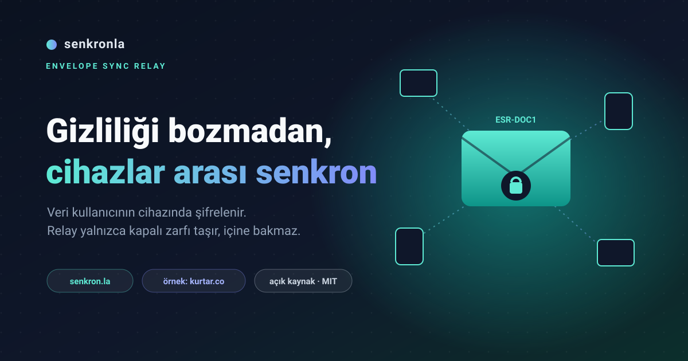
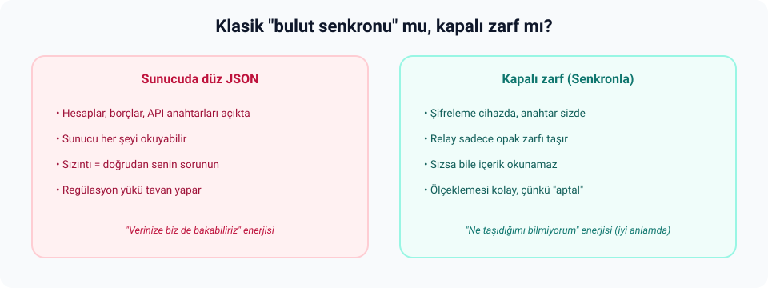
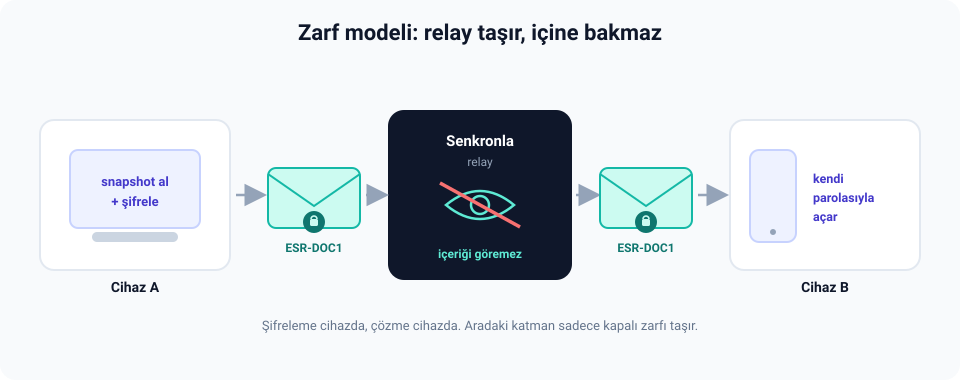
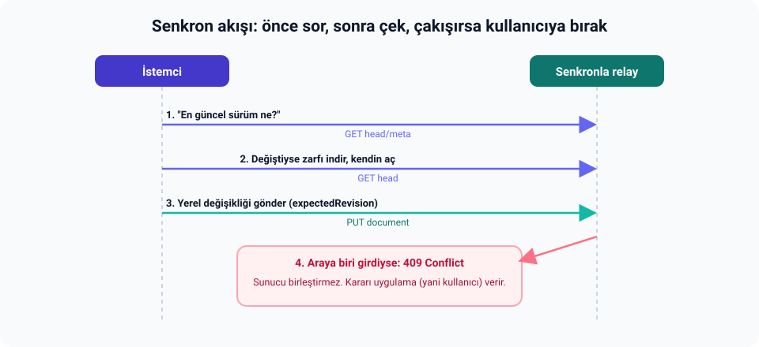
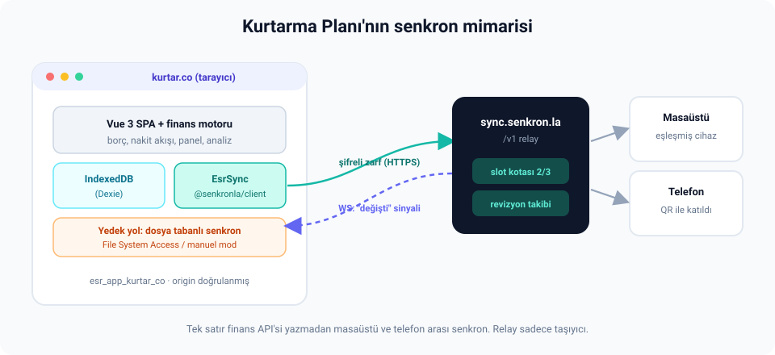
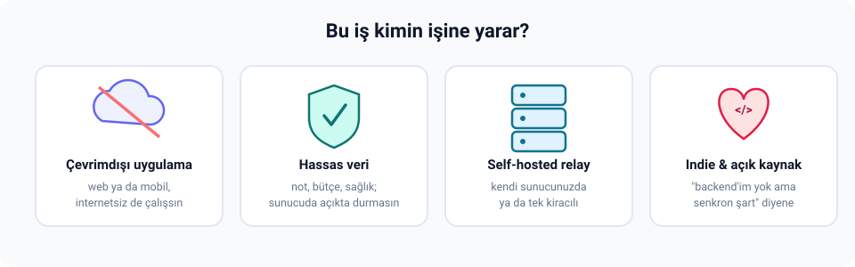
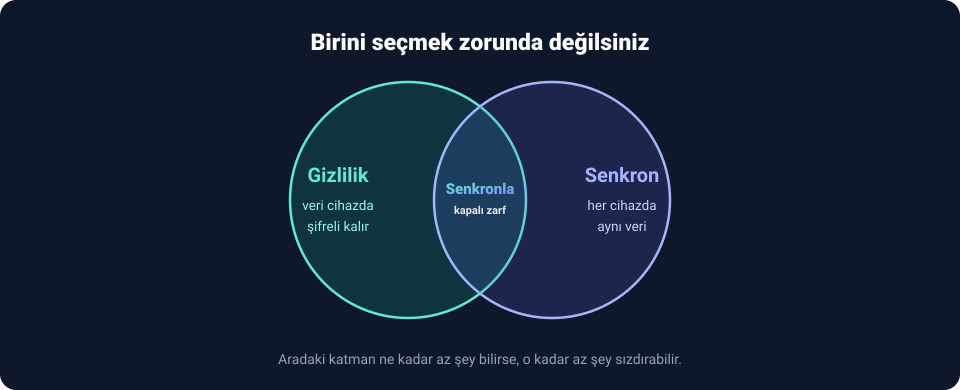

# Veriyi kullanıcıda bırakıp yine de cihazlar arası senkronu çözmek: Senkronla'yı neden yazdım?

Her şey küçük ve biraz da inatçı bir cümleyle başladı: "Kullanıcının borçları, hesapları, gelir gider geçmişi onun cihazında kalsın." Bir kişisel finans uygulaması yapıyordum ve bu cümleden taviz vermek istemiyordum. Yani veriyi bir sunucuya yığıp orada açık açık tutmaya niyetim yoktu.

Ama dürüst olalım, ben de herkes gibi sabah telefonda girdiğim bir kaydı akşam masaüstünde görmek istiyorum. İşte o klasik ikilem tam buradan giriyor sahneye: ya gizlilikten ödün ver ya da senkrondan vazgeç. Bana ikisini birden isteyen şımarık kullanıcı diyebilirsiniz, itiraz etmem.

Çoğu "bulut senkronu" dediğimiz şeyin kapağını kaldırınca altından ne çıkıyor? Sunucuda okunabilir veri. Hesap bakiyeleri, kredi taksitleri, bazen de bir köşede unutulmuş API anahtarları. Aradaki aktarım katmanı (relay diyelim) içeriği okuyabiliyorsa, o verinin güvenliği de mahremiyeti de artık tamamen sizin omuzlarınızda.

Ben tam tersini istedim. Uygulama kendi verisinin tek sahibi olsun, aradaki katman ise içine bakmadan sadece kapalı bir zarfı taşısın. Bu inattan da **Senkronla** çıktı.

## Peki Senkronla tam olarak ne?

Kısa cevap: açık kaynaklı, kendi sunucunuzda barındırabileceğiniz bir senkron aktarım katmanı. Biraz daha kravatlı söylemek gerekirse Senkronla bir **Envelope Sync Relay**, yani "zarf senkron relay'i". İsim kulağa hafif fazla ciddi geliyor, farkındayım, ama mantığı gerçekten posta zarfı kadar sade.

Şöyle hayal edin. Uygulamanız bir anlık görüntü (snapshot) alıyor, bunu kendi cihazında şifreliyor ve `ESR-DOC1` formatında kapalı bir zarfın içine koyuyor. Senkronla bu zarfı alıyor, saklıyor, kaçıncı sürüm olduğunu (revizyonunu) takip ediyor, cihaz eşleştirmesini ve kullanıcı başına cihaz kotasını yönetiyor, biri yeni bir şey yazınca diğer cihazlara "hey, yeni içerik var" diye haber veriyor. Ama zarfın içine asla, hiçbir koşulda bakmıyor.

Literatürde buna zero-knowledge yaklaşımı deniyor. Ben sevdiğim için "kasıtlı cahillik" diyorum: katman ne kadar az şey bilirse, kötü bir günde o kadar az şey sızdırabilir.

Şunu da netleştireyim, çünkü en çok yanlış anlaşılan kısım bu: Senkronla bir "not uygulaması backend'i" ya da hazır bir "finans API'si" değil. İş mantığı, veri modeli, şifreleme, hepsi uygulama tarafında kalıyor. Senkronla yalnızca o ince ve sessiz taşıyıcı olmaya talip. Kulağa mütevazı geliyor, öyle de olmalı zaten.

Pratik bilgiler:

- Web sitesi ve dokümantasyon: [senkron.la](https://senkron.la)
- Kaynak kod: [github.com/kemalersin/senkronla](https://github.com/kemalersin/senkronla)
- İstemci SDK: [`@senkronla/client`](https://www.npmjs.com/package/@senkronla/client) (içinde `EsrSync` denen kullanışlı bir facade, çevrimdışı kuyruk ve çakışma callback'leri var)

Kendi relay'inizi Docker Compose ile ya da Node.js 22 ve üzeriyle ayağa kaldırabiliyorsunuz. Haberleşme REST `/v1` üzerinden, isteğe bağlı olarak da WebSocket ile oluyor. WebSocket kısmı "push-to-pull" mantığında çalışıyor: sunucu size sadece "değişiklik oldu" diye ufak bir dürtme gönderiyor, asıl veriyi yine siz HTTP ile çekiyorsunuz. Yani gerçek zamanlı hissini alıyorsunuz ama trafik kontrolden çıkmıyor.

## "Zarf" derken neyi kastediyorum?

Geleneksel senkronizasyonda sunucu genelde caka satar: "Doğru veri bende, gerisini ben hallederim." Envelope Sync Relay modeli bu rolü kibarca tersine çeviriyor. Akış kabaca şöyle:

1. İstemci önce `GET head/meta` ile soruyor: "Uzaktaki en güncel sürüm hangisi?"
2. Sürüm değişmişse `GET head` ile zarfı indiriyor ve kendi parolasıyla açıyor. Parolayı sunucu bilmiyor, dolayısıyla zarfı açma yetkisi tamamen kullanıcıda.
3. Yerelde bir değişiklik varsa `PUT` ile yeni zarfı gönderiyor. Burada `expectedRevision` denen alanla iyimser kilitleme (optimistic concurrency) yapılıyor: "Ben en son şu sürümü görmüştüm, hâlâ o mu?"
4. Bu arada başka bir cihaz araya girip sürümü değiştirmişse sunucu `409 Conflict` dönüyor. Önemli kısım şu: sunucu çakışmayı kendi kafasına göre çözmüyor, kararı uygulamanın arayüzüne, yani aslında kullanıcıya bırakıyor.

Bu son madde benim için pazarlık konusu bile değildi. Hassas finans verisiyle uğraşırken "sunucu otomatik birleştirme yaptı ve bir şeyleri sessizce ezdi" cümlesinden daha ürkütücü az şey var. Senkronla'da birleştirme kararı sizde, sunucu sadece elini kaldırıp "burada bir çakışma var" diyor. Sonuçta relay'i rahatça ölçekleyebiliyorsunuz, çünkü orada ne karmaşık iş mantığı ne de şifre çözme dönüyor. Bütün o yük uygulamada, olması gereken yerde.

İşin operatör tarafı da boşlanmamış. Tek bir namespace altında birden çok belge tutabiliyorsunuz (mesela `primary` ve `settings` ayrı), cihaz eşleştirme ve kurtarma ifadesi akışları hazır, slot lisanslama ile cihaz sayısını sınırlayabiliyorsunuz, uygulama kaydıyla da hangi origin'lerin bağlanabileceğini doğrulayabiliyorsunuz. Hepsi dokümanlarda ve operatör portalında duruyor.

## Teoriden sahaya: Kurtarma Planı

İtiraf vakti: ben bir şeyin gerçekten çalıştığına, ancak kendi günlük hayatımda kullanıp da canım yanmayınca inanırım. O yüzden Senkronla'yı ilk olarak kendi projeme bağladım, yani bir nevi kendi ilacımı kendim içtim: **Kurtarma Planı**.

- Depo: [github.com/kemalersin/kurtarma-plani](https://github.com/kemalersin/kurtarma-plani)
- Canlı demo: [kurtar.co](https://kurtar.co/)

Kurtarma Planı tam anlamıyla local-first bir uygulama. Vue 3 ile yazıldı, verisini tarayıcıda IndexedDB üzerinde (Dexie aracılığıyla) tutuyor ve production çıktısı tek bir HTML dosyası. O kadar bağımsız ki dosyayı indirip `file://` ile bile açabiliyorsunuz; arkada dönen gizli bir sunucu, gizli bir maliyet yok. Borç takibi, nakit akışı, panel, analiz, hepsi tarayıcının içinde yaşıyor.

Senkron tarafında kullanıcıya iki yol sunuyorum:

1. **Dosya tabanlı otomatik senkron.** Tarayıcının File System Access özelliğini kullanıyor, desteklemeyen ortamlarda da kibarca manuel moda düşüyor. Local-first dünyasının eski tüfeği, güvenilir yedeği.
2. **Senkronla.** İşte burada `@senkronla/client` ve `EsrSync` sahneye çıkıyor. Production'da uygulama `https://sync.senkron.la/v1` adresindeki relay'e bağlanıyor.

Ayarlardan kullanıcı "Senkron.la" yöntemini seçince, uygulama `esr_app_kurtar_co` kimliğiyle kayıtlı bir web uygulaması olarak relay'e bağlanıyor. Operatör konsolunda `kurtar.co` ve `www.kurtar.co` origin'leri doğrulanmış durumda, yani rastgele bir adresten gelen istek kapıdan içeri alınmıyor.

Entegrasyonda beni en çok gülümseten birkaç ayrıntı:

**Cihaz eşleştirme zahmetsiz.** Ana cihaz 6 haneli bir kod ve bir QR üretiyor, ikinci cihaz "katıl" akışıyla aynı namespace'e giriyor. Telefonla QR'ı okutup masaüstüne bağlanmak, kahveyi karıştırmaktan kısa sürüyor.

**Canlı bildirim gerçekten canlı.** Arayüzde "Relay bağlı, canlı bildirim aktif" yazısını görünce push-to-pull devreye giriyor ve bir cihazdaki değişiklik diğerinde neredeyse anında beliriyor. İlk kez iki ekranı yan yana koyup test ettiğimde biraz heyecanlandığımı itiraf edeyim.

**Slot kotası şeffaf.** Kullanıcı "2/3 cihaz" gibi net bir gösterge görüyor. Ücretsiz kota relay tarafında yönetiliyor, uygulamanın ayrıca bunu takip etme derdi yok.

**Zarf şifresi opsiyonel ama dürüst.** Senkron parolası uygulamanın kendi arayüzünde belirleniyor ve kurtarma ifadesinden ayrı tutuluyor. Buradaki uyarı acımasız ama gerçek: parolayı kaybederseniz uzaktaki şifreli veri açılmaz. Kulağa hoş gelmiyor, biliyorum, ama "verinize kimse bakamaz" sözünü tutmanın bedeli tam olarak bu. Sihirli geri alma tuşu olsaydı zaten sözü tutmuyor olurduk.

Özetle Kurtarma Planı, tek satır finans API'si yazmadan masaüstü ile telefon arasında senkron kazandı. Relay sadece taşıdı, içeriğe parmağını bile sürmedi. Bu deneyim bana şunu çok net gösterdi: local-first ürünler için ayrı bir senkron altyapısı tutmak gerçekten mantıklı. Her proje oturup kendi REST katmanını, çakışma çözümünü ve cihaz eşleştirmesini sıfırdan icat etmek zorunda değil. O tekerleği yeterince icat ettik.

İsterseniz ekran görüntülerine de göz atabilirsiniz; Senkronla deposunda [docs/screenshots/](../screenshots/) altında `kurtar_co_00.png` ile `kurtar_co_03.png` arasında duruyorlar.

## Bu iş kimin işine yarar?

Açık olayım, Senkronla her projeye lazım değil. Çekiç elinde diye her şeyi çivi sanma tuzağına düşmeyelim. Ama şu tariflerden biri sizinkine benziyorsa bir uğrayın derim:

- Çevrimdışı da çalışması gereken web ya da mobil uygulamalar yapıyorsanız.
- Not, bütçe, sağlık, üretkenlik gibi hassas veriyle çalışıyorsanız ve veriyi sunucuda açıkta tutmak içinize sinmiyorsa.
- Kendi sunucunuzda barındırdığınız ya da tek kiracılı bir relay arıyorsanız.
- "Düzgün bir backend'im yok ama cihazlar arası senkron şart" diyen bir indie geliştiriciyseniz veya açık kaynak bir proje yürütüyorsanız.

Senkronla MIT lisanslı. Teknik şartname, OpenAPI tanımı, operatör portalı ve entegrasyon rehberlerinin hepsi [senkron.la/guides](https://senkron.la/guides) altında derli toplu duruyor.

## Toparlarsak

Bu yazıyı yazma sebebim aslında tek bir yaygın yanlış inancı kırmak: veriyi kullanıcının cihazında tutmakla cihazlar arası senkronu birbirine düşman sanmak. Oysa aralarına yeterince ince, kapalı ve mümkün olduğunca "hiçbir şey bilmeyen" bir katman koyduğunuzda, hem gizlilik nefes alıyor hem de sizin operasyonel yükünüz hafifliyor. İkisini aynı anda elde etmek tahmin ettiğinizden kolay.

Senkronla'yı işte bu yüzden paylaşıyorum. Kurtarma Planı entegrasyonunu da "tamam anladık, peki gerçek bir uygulamada nasıl hissettiriyor?" sorusuna somut bir cevap olsun diye anlattım.

Denemek isterseniz başlangıç noktaları şunlar:

- Senkronla: [senkron.la](https://senkron.la) ve [GitHub](https://github.com/kemalersin/senkronla)
- Kurtarma Planı: [kurtar.co](https://kurtar.co) ve [GitHub](https://github.com/kemalersin/kurtarma-plani)

Geri bildirim, hata bildirimi ya da "bence şöyle olsaydı daha iyiydi" türünden fikirler her iki depoda da başımın üstünde yeri var. Açık kaynak yapmanın en keyifli tarafı zaten bu sohbet kısmı. Kod nasılsa yarın yine değişecek.
