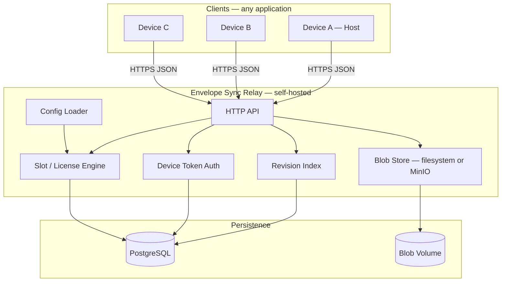
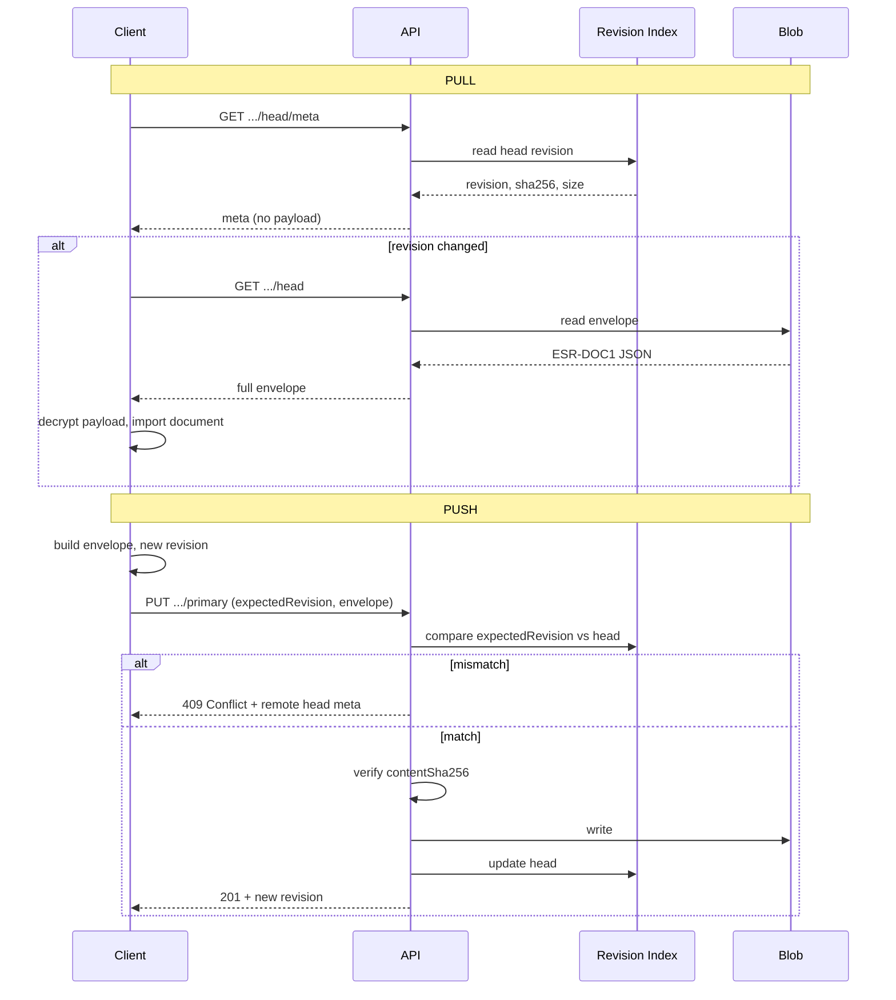
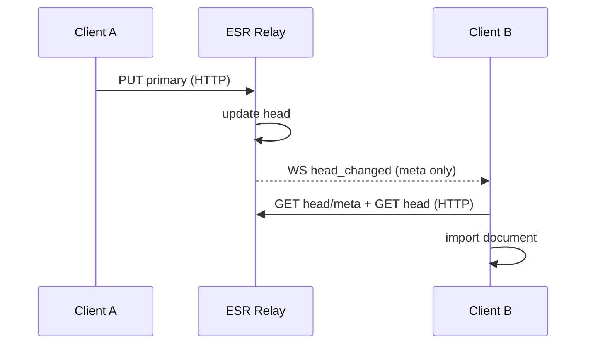

# 02 — Architecture

## 1. System diagram



## 2. Component responsibilities

### 2.1 HTTP API

- REST `/v1/*`
- JSON request/response
- `Authorization: Bearer <device_token>` (namespace operations)
- `Authorization: Bearer <admin_token>` (admin operations — optional MVP)

### 2.2 Device Token Auth

- Each paired device receives a long-lived opaque token
- Server stores only `SHA-256(token)`
- Token bound to namespace; invalid in other namespaces

### 2.3 Slot / License Engine

- `max_devices = free_limit + purchased_slots`
- Slot check before pairing
- Unlock code verification and `purchased_slots` increment
- Operator config: `on_limit_reached.mode`

### 2.4 Revision Index

- Single **head** revision per namespace + document
- Append-only revision history (MVP: head sufficient; history optional)
- Optimistic concurrency: `expectedRevision` / `If-Match`

### 2.5 Blob Store

- Content: serialized `ESR-DOC1` envelope (full JSON) or payload only
- **Recommended MVP:** Store entire envelope JSON as blob (simple debug, single read)
- Blob key: `{namespace_id}/primary/{revision}.json` or content hash

### 2.6 Config Loader

- YAML or env based
- Hot reload optional (MVP: restart sufficient)

## 3. Push / Pull flow



## 4. Sync loop rule

Full sync (manual or automatic):

```
1. GET head/meta
2. IF remote revision != known: GET head → import (conflict check client-side)
3. IF local changes: PUT primary (expectedRevision = last known remote)
4. IF 409: conflict UI — remote wins | local wins | cancel
```

Server does not trigger automatic pull/push; client is responsible. **WebSocket (v1.1):** server broadcasts `head_changed`; client still performs HTTP pull (doc 13).

## 5. WebSocket notification layer (v1.1)



Details: [13-WEBSOCKET-NOTIFICATIONS.md](./13-WEBSOCKET-NOTIFICATIONS.md)

## 6. Deployment topology

### 6.1 Single server (MVP recommended)

```
docker compose:
  - esr-api (Node/Bun/Go — implementer chooses)
  - postgres:16
  - volume: /data/blobs
```

Reverse proxy: Caddy or nginx (TLS termination).

### 6.2 Minimum resources

| Scale | CPU | RAM | Disk |
|-------|-----|-----|------|
| MVP / personal | 1 vCPU | 512 MB | 10 GB + blob |
| 100 namespace | 2 vCPU | 1 GB | 50 GB |

### 6.3 Ports

| Service | Port |
|---------|------|
| API | 8080 (internal) |
| HTTPS | 443 (proxy) |
| Postgres | 5432 (internal only) |

## 7. Recommended technology stack (implementer flexible)

| Layer | Recommendation | Alternative |
|-------|----------------|-------------|
| Runtime | Node 22 + TypeScript | Go, Rust |
| HTTP | Hono / Fastify | axum, chi |
| DB | PostgreSQL 16 | — |
| ORM | Drizzle / Kysely | sqlx |
| Validation | Zod | — |
| Blob | Local filesystem | MinIO S3 API |
| ID | ULID (`ulid` npm) | UUIDv7 |
| WS | `ws` or `@hono/node-ws` | — |
| Tests | Vitest + supertest | pytest, go test |
| Container | Docker multi-stage | — |

**Not mandatory** — implementer may choose equivalent; API and protocol contract must not change.

## 8. Repo structure (recommended monorepo)

```
senkronla/
├── packages/
│   ├── server/          # API + worker
│   ├── protocol/        # ESR-DOC1 Zod schemas, shared types
│   ├── client/          # Transport SDK (browser + node)
│   └── cli/             # admin: generate-unlock-code, migrate
├── docker/
│   ├── docker-compose.yml
│   └── Caddyfile
├── docs/                # this specification
│   ├── en/
│   ├── tr/
│   ├── openapi.yaml
│   └── OPERATOR.md
├── openapi.yaml         # repo root SSOT
└── package.json         # npm workspaces (optional)
```

## 9. Client SDK modules (universal)

```
@esr/protocol     — envelope parse/build/verify; identity: generateNamespaceId, generateRecoveryPhrase, buildRecoveryKeyProof
@esr/client       — EsrSync: default facade (doc 14) — connect, ensureNamespace, sync, pairing
@esr/client       — RelayClient + SyncEngine + NotificationClient: advanced / internal
```

Application only implements `DocumentAdapter`:

```typescript
interface DocumentAdapter {
  buildDocument(): Promise<string>       // inner payload JSON
  importDocument(payload: string): Promise<void>
  getEncryptionOptions(): EncryptionOptions
}
```

## 10. Namespace isolation

- `namespaceId` UUID v4 — globally unique; no collision on single relay instance
- DB: `namespace_id` unique constraint
- Blob path prefix: `namespace_id`
- Application separation: envelope `contentType` + relay URL deployed by operator
- Rate limit per namespace or IP (optional)

## 11. Observability

| Metric | Source |
|--------|--------|
| `esr_push_total` | counter |
| `esr_pull_total` | counter |
| `esr_conflict_409_total` | counter |
| `esr_pairing_total` | counter |
| `esr_ws_connections` | gauge |
| `esr_ws_notifications_total` | counter |

Log: structured JSON; **payload/envelope body never logged**.

Health: `GET /health` → `{ "status": "ok", "db": "ok", "blob": "ok", "websocket": "enabled"|"disabled" }`
