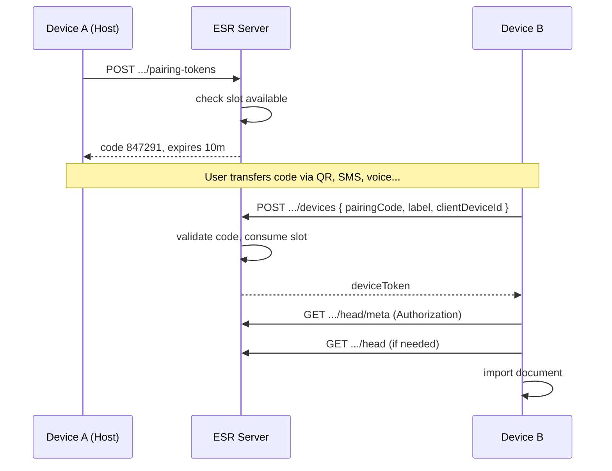
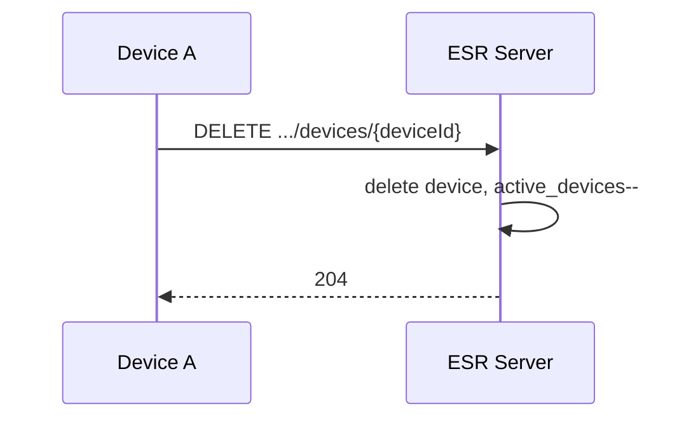

# 05 — Device Pairing and Recovery

## 1. Identity model (no accounts)

ESR has no user accounts. Identity consists of three elements:

| Element | Purpose | Storage |
|-------|------|---------|
| **namespaceId** | Data container | Server DB |
| **device_token** | API access | Client secure storage; hash on server |
| **recovery phrase** | Disaster recovery | Client/user only; Argon2id hash on server |

## 2. Recovery key (C)

### 2.1 Generation (client — required)

- **BIP39 English 24 words** — `@esr/protocol.generateRecoveryPhrase()` (application/implementer does not generate its own)
- Client generates phrase **before** namespace create
- Shown to user once; copy confirmation in UI

If the application has no fixed workspace/profile UUID for `namespaceId`, use `@esr/protocol.generateNamespaceId()` (UUID v4). If an existing id exists, the adapter returns it; still validated with `isValidNamespaceId()` (doc 09).

### 2.2 Sending to server

Server **never** sees the phrase. Client produces `recoveryKeyProof` with `@esr/protocol.buildRecoveryKeyProof(phrase)`:

```typescript
import { generateRecoveryPhrase, buildRecoveryKeyProof } from '@esr/protocol'

const recoveryPhrase = generateRecoveryPhrase()
const recoveryKeyProof = await buildRecoveryKeyProof(recoveryPhrase)
// POST namespace create: { recoveryKeyProof: { salt, hash } }
```

Argon2id parameters (SSOT — `packages/protocol/src/identity.ts`):

| Parameter | Value |
|-----------|--------|
| memoryCost | 65536 (64 MiB) |
| timeCost | 3 |
| parallelism | 4 |
| hashLength | 32 |
| salt | 16 byte random |

### 2.3 Recovery verification

On the recover endpoint, the client produces proof with the same phrase; server verifies against stored salt+hash.

**Failure:** 401 `RECOVERY_INVALID`

Rate limit: 5/hour/namespace (brute force protection).

### 2.4 State after recovery

| Field | Behavior |
|------|----------|
| devices | All deleted (token invalidated) |
| purchased_slots | **Preserved** |
| free_device_limit | Preserved |
| blob / head revision | **Preserved** |
| pairing tokens | All cancelled |

New host starts as a single device; user re-adds other devices via pairing.

## 3. Device pairing (B)

### 3.1 Flow diagram



### 3.2 Pairing code rules

| Rule | Value |
|-------|--------|
| Format | 6 digit numeric |
| Entropy | crypto random, 000000-999999 |
| TTL | Default 600s, max 3600s |
| Usage | Single redeem |
| Invalidation | Redeem, TTL, or new token (optional: cancel old) |

Brute force: 6 digit → rate limit IP + namespace; 10 failed → 15 min lock.

### 3.3 QR payload format

```
esr://pair/v1/{namespaceId}?code={code}&exp={unix}&host={urlEncodedLabel}
```

Client implements QR encode/decode; server only validates `code`.

### 3.4 clientDeviceId vs server deviceId

| ID | Source | Usage |
|----|--------|----------|
| `clientDeviceId` | Client persistent UUID | Envelope `deviceId`, UI "this device" |
| `deviceId` (server) | ULID | API path, revoke target |

Mapping: `(namespace_id, client_device_id)` unique in DB — same physical device on re-pair replaces old record or rejects (preference: **revoke old device + new token**; slot count unchanged for same clientDeviceId).

**Re-pair policy (recommended):**

```
IF clientDeviceId already paired:
  revoke old device row (same slot)
  create new device_token
ELSE:
  consume new slot if under limit
```

## 4. Device removal



### 4.1 Rules

- Removal **immediately** frees the slot
- Another device pairing → uses free slot, **no extra payment**
- Last device cannot be removed → `LAST_DEVICE_PROTECTED`
- Removed device's token is immediately invalid

### 4.2 Who can remove whom (MVP)

Every authenticated device can remove **any** device in the same namespace (universal simplicity).

Future option: host only or `canManageDevices` flag.

## 5. Host concept

- First device to create is automatically considered host (`is_host: true` DB flag)
- Host has **no** extra privileges in MVP (any device can pair)
- After recovery, the new device becomes host

## 6. device_token security

| Topic | Implementation |
|------|----------|
| Generation | 32 byte random, base64url |
| Storage (server) | SHA-256(token), never plaintext |
| Storage (client) | localStorage / secure storage / OS keychain wrapper |
| Transport | HTTPS only |
| Rotation | Re-pair or recovery |

Token leaked → another device with a token can DELETE that device.

## 7. Slot check during pairing

Before pairing token **creation** and device **addition**:

```typescript
if (activeDevices >= maxDevices) {
  if (config.onLimitReached.mode === 'payment') {
    throw DEVICE_LIMIT_PAYMENT_REQUIRED
  } else {
    throw DEVICE_LIMIT_BLOCKED
  }
}
```

**Important:** Token creation also requires a slot — host cannot generate a new code when limit is full (user continues after unlock).

## 8. Client state machine

```
[unpaired]
   │ create namespace OR recover OR pair
   ▼
[paired]
   │ sync enabled
   ├─► [syncing]
   ├─► [conflict]
   └─► [limit_blocked]

[paired] ── revoke self ──► [unpaired] (local data remains app responsibility)
```

## 9. Client storage (recommended keys)

| Key | Content |
|-----|--------|
| `esr.relayUrl` | Server base URL |
| `esr.namespaceId` | Namespace UUID |
| `esr.deviceToken` | Bearer token |
| `esr.clientDeviceId` | Persistent device UUID |
| `esr.knownRemoteRevision` | Last known head revision |
| `esr.lastPushAt` | ISO timestamp |
| `esr.lastLocalMutationAt` | ISO timestamp |

Recovery phrase: **separate** secure channel (password manager export); not mixed with `esr.*`.

## 10. Test scenarios (required)

1. Create → 1 device, limits correct
2. Pair 2nd device within free limit → success
3. Pair 3rd at limit, mode=block → 403
4. Pair 3rd at limit, mode=payment → 403, unlock → pair success
5. Revoke device → active decreases → pair new without payment
6. Recovery → all tokens invalid, slots preserved, head preserved
7. Wrong recovery → 401
8. Expired pairing code → 400
9. Re-pair same clientDeviceId → slot count unchanged
10. DELETE last device → 403 LAST_DEVICE_PROTECTED
