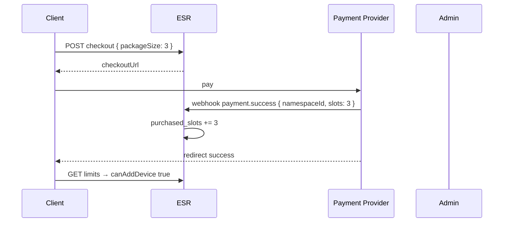

# 06 — Slot Licensing (No Accounts)

## 1. Model overview

ESR revenue/limit model operates **without user accounts**, per namespace (data container).

```
max_devices = free_device_limit + purchased_slots
active_devices = currently paired device count

can_add_device = active_devices < max_devices
```

| Concept | Description |
|--------|----------|
| **free_device_limit** | Operator config; concurrent device ceiling without payment |
| **purchased_slots** | Slots added via unlock code / payment; **cumulative** |
| **Slot** | Concurrent active device entitlement; returns when device is removed |
| **One-time payment** | No subscription; new package purchased as limit fills |

## 2. Behavior when limit is reached

Operator selects via `on_limit_reached.mode`:

### 2.1 `payment`

```
active_devices >= max_devices
  → pairing token: 403 DEVICE_LIMIT_PAYMENT_REQUIRED
  → POST devices: 403 DEVICE_LIMIT_PAYMENT_REQUIRED
  → response.details.slotPackages: [3, 5, 10]
```

Client offers unlock code or checkout URL.

### 2.2 `block`

```
active_devices >= max_devices
  → 403 DEVICE_LIMIT_BLOCKED
  → no payment UI offered
  → user can free a slot by removing a device
```

## 3. Slot packages

Config:

```yaml
slot_packages: [3, 5, 10]
```

- Package size = amount of `purchased_slots` to add
- Pricing is external to server (Stripe/Iyzico/manual); ESR only increases slots
- Multiple packages can apply to same namespace (cumulative):

```
free=2, purchased=0, max=2
  → unlock +3 → purchased=3, max=5
  → unlock +5 → purchased=8, max=10
```

## 4. Payment cycle

User filled 5 device slots (5 paired devices). Wants to add 6th device:

```
mode=payment:
  1. API 403 DEVICE_LIMIT_PAYMENT_REQUIRED
  2. User purchases package (e.g. +3 slots)
  3. purchased_slots += 3 → max=8
  4. Pairing continues (6th, 7th, 8th device)
  5. At 8 full, cycle repeats

mode=block:
  1. API 403 DEVICE_LIMIT_BLOCKED
  2. User removes a device → max still 5 but active=4
  3. Can add new device (no payment)
```

**Slot recovery:** Device removal does `active_devices--`; `purchased_slots` unchanged. Free slot used on another device **at no cost**.

## 5. Unlock code format

### 5.1 Structure

```
ESR-UNLK-{slots}-{signature}
```

Example: `ESR-UNLK-3-K7M9P2Q4R6T8`

| Part | Description |
|-------|----------|
| `ESR-UNLK` | Fixed prefix |
| `{slots}` | 1-999 integer |
| `{signature}` | HMAC or base32 encoded signature |

### 5.2 Generation (server / admin CLI)

```typescript
function generateUnlockCode(slots: number, namespaceId: string, secret: string): string {
  const payload = `${namespaceId}:${slots}:${Date.now()}`
  const sig = hmacSha256(secret, payload).slice(0, 12) // base32 encode
  return `ESR-UNLK-${slots}-${toBase32(sig)}`
}
```

**Alternative (simpler MVP):** Code is random unique in DB; no signature; redeem table.

```sql
unlock_codes (
  code TEXT PRIMARY KEY,
  namespace_id, slots, expires_at, redeemed_at
)
```

### 5.3 Redeem rules

- Code bound to namespace or bound at redeem time (preference: **namespace required when admin generates**)
- Single use → `UNLOCK_CODE_ALREADY_REDEEMED`
- Expired → `UNLOCK_CODE_INVALID`
- After redeem: `purchased_slots += code.slots`

### 5.4 Client flow

```
403 DEVICE_LIMIT_PAYMENT_REQUIRED
  → Modal: "3 device slots — [Buy] [Enter code]"
  → Buy: checkout URL → webhook/admin → code or automatic slot
  → Enter code: POST /unlock
  → Retry pairing
```

## 6. Payment integration (optional Phase 2)

ESR core does not process payments; webhook adapter:



Webhook security: HMAC signature, idempotency key.

**MVP:** Admin CLI manual unlock code; no checkout webhook.

## 7. Per-namespace override

Operator overrides for VIP or test namespaces are stored in the database and resolved at runtime. See [17-OPERATOR-LIMIT-OVERRIDES.md](./17-OPERATOR-LIMIT-OVERRIDES.md).

Resolution order: namespace → app → developer → namespace row snapshot → server config default.

Effective:

```
free = resolved freeDeviceLimit
max = free + resolved purchasedSlots
```

Admin API: `GET/PATCH /v1/admin/namespaces/{namespaceId}/limits`.

## 8. free_device_limit initial trigger

"Initial trigger is configurable" = operator sets `default_free_device_limit`.

| Config | Behavior |
|--------|----------|
| `default_free_device_limit: 1` | Limit at 2nd device |
| `default_free_device_limit: 2` | Limit at 3rd device |
| `default_free_device_limit: 0` | Payment/block after 1st device |

`free_device_limit` can be snapshotted at namespace create (grandfather): changing global config does not affect old namespaces (preference: **yes, copy `free_device_limit` to namespace row**).

## 9. Grandfathering policy

| Scenario | Recommended |
|---------|----------|
| Global free limit lowered | Registered `free_device_limit` preserved on existing namespaces |
| active > new max (rare admin intervention) | New pairing forbidden; existing devices remain |
| purchased_slots | Never automatically removed |

## 10. Audit

`unlock_events` table (doc 10):

- namespace_id, slots_added, source (code|webhook|admin), created_at
- No PII

## 11. Test scenarios

1. free=2, 2 devices, mode=block → 3rd device 403 BLOCKED
2. free=2, unlock +3, max=5, 5 devices, mode=payment → 6th device 403 PAYMENT
3. 5 devices, revoke 1, active=4 → 5th device can be added again without payment
4. unlock +3 twice → purchased=6 (cumulative)
5. invalid code → 400
6. redeem same code twice → 409 ALREADY_REDEEMED
7. recovery → purchased preserved
