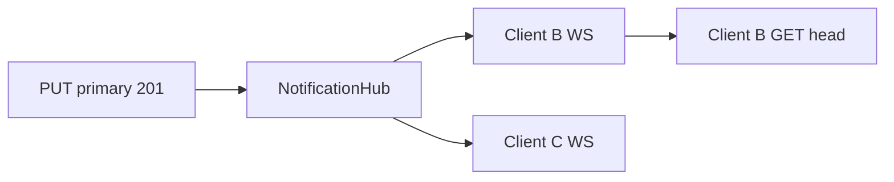

# 13 — WebSocket Notifications

This document defines ESR's **push-to-pull** notification channel. WebSocket **does not carry data**; it only sends the signal “remote head changed, do HTTP pull”.

**Spec version:** 1.1.0 (together with REST v1; WS optional but defined in spec)

---

## 1. Purpose and limits

| WebSocket does | WebSocket does not |
|----------------|-------------------|
| `head_changed` meta broadcast | Snapshot / envelope delivery |
| `limits_changed` (slot unlock) | Conflict resolution |
| Connection liveness (ping/pong) | Entity merge |
| Pull trigger signal | Fully replace polling |

**Golden rule:** After every notification the client still runs **HTTP GET head/meta → GET head if needed**. Single sync code path is preserved.

---

## 2. Why polling alone was not enough

In HTTP-only mode, Client B pulls at most ~45 s (or on focus/visible) after Client A pushes. With WebSocket, latency drops to **sub-second**; battery use can be lower than polling (sparse interval + instant notify).

**Polling fallback required:** WS off, proxy down, tabs in background — `GET head/meta` still runs periodically or on visibility.

---

## 3. Endpoint

```
wss://{host}/v1/namespaces/{namespaceId}/notifications
```

| Property | Value |
|----------|-------|
| Protocol | WebSocket (RFC 6455) |
| TLS | WSS required (production) |
| Subprotocol | `esr-notifications-v1` (Sec-WebSocket-Protocol) |
| Identity | `device_token` (same as REST) |

### 3.1 Authentication (upgrade)

**Preferred — Authorization header (RFC-compliant proxies):**

```http
GET /v1/namespaces/{namespaceId}/notifications HTTP/1.1
Host: sync.senkron.la
Upgrade: websocket
Connection: Upgrade
Sec-WebSocket-Protocol: esr-notifications-v1
Authorization: Bearer dvt_xxxxxxxx
```

**Alternative — first message (environments that cannot send headers):**

Connection opens → client within 5 s:

```json
{ "type": "auth", "token": "dvt_xxxxxxxx" }
```

Server:

```json
{ "type": "auth_ok", "deviceId": "01JF...", "namespaceId": "..." }
```

or connection closed (4401 custom code or `auth_fail` + close).

**Query string token (`?token=`) not recommended in production** — access log leakage.

---

## 4. Message format

UTF-8 JSON text frame. Binary frames not used (v1).

### 4.1 Server → client

```typescript
type WsServerMessage =
  | {
      type: 'auth_ok'
      deviceId: string
      namespaceId: string
      serverTime: string // ISO 8601
    }
  | {
      type: 'head_changed'
      documentId: 'primary'
      revision: string
      contentSha256: string
      writtenAt: string
      writerDeviceId: string
    }
  | {
      type: 'limits_changed'
      maxDevices: number
      activeDevices: number
      purchasedSlots: number
    }
  | { type: 'ping'; ts: string }
  | {
      type: 'error'
      code: string
      message: string
    }
  | { type: 'auth_fail'; code: string; message: string }
```

### 4.2 Client → server

```typescript
type WsClientMessage =
  | { type: 'auth'; token: string }           // only when header auth unavailable
  | { type: 'pong'; ts: string }              // ping response
  | { type: 'subscribe'; documentId?: string; documentIds?: string[] }  // optional filter 
```

### 4.3 Zod (packages/protocol)

`WsServerMessageSchema`, `WsClientMessageSchema` — exported from `@esr/protocol`.

---

## 5. Event broadcast rules

### 5.1 `head_changed`

**When:** After successful `PUT .../documents/{documentId}` (201).

**To whom:** Open WS connections in the same `namespaceId`. If the client sent `subscribe` with `documentIds`, only matching `documentId` values are delivered; otherwise all documents (v1 default).

**Payload:** Same fields as `GET head/meta` (+ `writerDeviceId`).

```typescript
hub.broadcast(namespaceId, {
  type: 'head_changed',
  documentId: 'primary',
  revision,
  contentSha256,
  writtenAt,
  writerDeviceId: envelope.deviceId,
})
```

### 5.2 `limits_changed`

**When:**

- Successful `POST .../unlock`
- Admin slot PATCH
- (Optional) after device pair/revoke when `canAddDevice` changed

**To whom:** Same namespace WS subscribers.

### 5.3 `ping` / `pong`

- Server sends `ping` every **30 s** (config)
- If no `pong` within **10 s**, server closes connection
- If client saw no ping in last 60 s, reconnect

---

## 6. Client behavior (`@esr/client`)

### 6.1 NotificationClient

```typescript
interface NotificationClientOptions {
  baseUrl: string
  namespaceId: string
  getDeviceToken: () => string | undefined
  onHeadChanged: (meta: HeadChangedPayload) => void
  onLimitsChanged?: (limits: LimitsChangedPayload) => void
  /** Polling interval when WS absent or disconnected (ms). Default 45_000 */
  pollIntervalMs?: number
  /** Close WS when document.hidden (battery). Default true */
  pauseWhenHidden?: boolean
}

interface NotificationHandle {
  connect(): void
  disconnect(): void
  readonly state: 'disconnected' | 'connecting' | 'connected' | 'paused'
}
```

### 6.2 Inside `onHeadChanged`

```typescript
onHeadChanged(meta) {
  if (meta.revision === knownRemoteRevision) return
  if (hasLocalChangesSinceLastPush()) {
    markConflictPending(meta)
    return
  }
  void relayClient.pullHead(namespaceId) // HTTP
}
```

Conflict and pull logic are the **same as existing SyncEngine**; WS is only a trigger.

### 6.3 Reconnect

- Exponential backoff: 1s → 2s → 4s → … max 60s
- Jitter ±20%
- After reconnect **always** `GET head/meta` (missed messages)
- `navigator.onLine` false → disconnect; `online` → reconnect

### 6.4 Together with polling

```typescript
mode: 'ws_with_poll_fallback' // default
```

| WS state | Pull trigger |
|----------|--------------|
| connected | `head_changed` + sparse poll (e.g. 5 min) |
| disconnected | poll 45 s + visibility/focus |
| disabled (server) | poll 45 s only |

If operator sets `websocket.enabled: false`, client does not attempt WS.

---

## 7. Server architecture



### 7.1 Single process (MVP)

```typescript
class NotificationHub {
  private rooms = new Map<string, Set<WebSocket>>() // namespaceId → sockets

  subscribe(namespaceId: string, ws: WebSocket, deviceId: string): void
  unsubscribe(namespaceId: string, ws: WebSocket): void
  broadcast(namespaceId: string, message: WsServerMessage): void
}
```

Auth middleware: token → namespaceId path match required (cannot subscribe to another namespace).

### 7.2 Multiple instances (v1.1+ optional)

Redis pub/sub channel: `esr:notify:{namespaceId}`

Push handler → Redis publish → all API pods forward to local WS.

MVP **single instance sufficient**; docker-compose single `api` service.

---

## 8. Configuration

```yaml
websocket:
  enabled: true
  pingIntervalSeconds: 30
  pongTimeoutSeconds: 10
  maxConnectionsPerNamespace: 20
  maxConnectionsPerDevice: 3          # same device multiple tabs
```

Env overrides (`load-config.ts`): `ESR_WEBSOCKET_ENABLED`, `ESR_WS_PING_INTERVAL`. Other keys above are **YAML only** today.

```bash
ESR_WEBSOCKET_ENABLED=true
ESR_WS_PING_INTERVAL=30
```

### 8.1 Reverse proxy (Caddy)

```
sync.senkron.la {
  reverse_proxy api:8080
}
```

Caddy handles WebSocket upgrade automatically. For nginx:

```nginx
proxy_http_version 1.1;
proxy_set_header Upgrade $http_upgrade;
proxy_set_header Connection "upgrade";
proxy_read_timeout 3600s;
```

---

## 9. Security

| Topic | Implementation |
|-------|----------------|
| Auth | Same `device_token` hash DB |
| Namespace isolation | Token only for own namespace WS path |
| Rate limit | Max WS connections per namespace |
| Log | WS frame body not logged (head_changed meta may be logged — never payload) |
| Revoke | Device revoke → server closes related WS (4403) |

Custom close codes (recommended):

| Code | Meaning |
|------|---------|
| 4401 | Auth failed |
| 4403 | Device revoked |
| 4429 | Too many connections |

---

## 10. Error codes (WS `error` message)

| code | Description |
|------|-------------|
| `WS_AUTH_REQUIRED` | First message auth not received |
| `WS_AUTH_INVALID` | Token invalid |
| `WS_NAMESPACE_MISMATCH` | Path vs token namespace |
| `WS_DISABLED` | WS disabled on server |

May be added to HTTP `GET /health` response:

```json
{ "websocket": "enabled" }
```

---

## 11. Test scenarios

1. A push → B WS `head_changed` → B HTTP pull → data equal
2. B offline WS → A push → B reconnect → head/meta catch-up
3. Revoke device → WS close 4403
4. `websocket.enabled: false` → client poll only, no WS upgrade
5. Ping timeout → reconnect
6. Conflict: B local edit + `head_changed` → conflict UI, no automatic pull
7. A push → A also receives `head_changed` → no-op if revision known

---

## 12. OpenAPI note

WebSocket endpoints are not fully modeled in OpenAPI 3.x. This document + `@esr/protocol` Zod schemas are SSOT. `openapi.yaml` `info.description` includes WS URL reference.

---

## 13. Implementation phase

`11-IMPLEMENTATION-PLAN.md` **Phase 7b — WebSocket** (after REST MVP, v1.1):

- [x] NotificationHub + WS route
- [x] PUT primary → broadcast
- [x] `@esr/client` NotificationClient
- [x] SyncEngine `ws_with_poll_fallback`
- [x] Proxy config example
- [x] Integration test: two mock clients

---

## 14. Intentionally out of scope

- Snapshot over WS
- Server-initiated push (HTTP PUT from server)
- GraphQL subscription
- WebRTC
