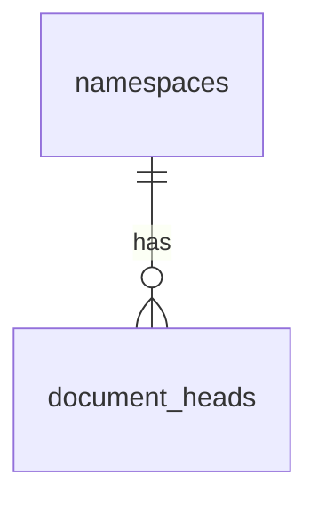

# 15 — Multi-Document per Namespace

| Field | Value |
|-------|-------|
| Status | **Spec v1.2 — shipped** (server, client SDK, docs, operator guide) |
| Approved | 2026-05-29 |
| Spec version | **1.2.0** (multi-document part of v1) |
| API prefix | `/v1` (unchanged; backward-compatible extension) |
| Protocol magic | `ESR-DOC1` (unchanged) |
| Envelope `schemaVersion` | `1` = primary only; `2` = arbitrary `documentId` |
| Builds on | REST MVP + WebSocket notifications (v1.1) |

> **Türkçe:** [../tr/15-MULTI-DOCUMENT.md](../tr/15-MULTI-DOCUMENT.md)

---

## 1. Summary

Spec **v1.2** defines one or more independent snapshot documents per namespace (e.g. `primary`, `settings`, `vault-notes`). Each document has its own revision chain, head, blob path, and conflict surface. The database uses `PRIMARY KEY (namespace_uuid, document_id)`.

**Backward compatibility:** Older integrations that only use `primary` and envelope `schemaVersion: 1` continue to work unchanged.

**Non-goals:**

- Entity-level CRDT merge (still client-side snapshot merge only)
- Document data over WebSocket
- Cross-document atomic transactions
- Federation between relays
- User accounts / OAuth

---

## 2. Motivation

| Use case | Single-document workaround | Multi-document benefit |
|----------|---------------|------------|
| App has settings + main data | Single `primary` JSON with nested keys | Separate push/pull/conflict per concern |
| Large snapshot + small config | Full re-upload on any change | Smaller envelopes, less bandwidth |
| Feature flags per document | Custom payload schema | Native `documentId` routing |
| Operator visibility | Admin shows one head | List all document heads |

v1 remains valid: apps that only need one snapshot continue using `primary` with zero migration.

---

## 3. Design principles

1. **Backward compatible by default** — `/documents/primary/*` and `schemaVersion: 1` envelopes keep working.
2. **Same sync semantics per document** — revision, 409 conflict, zero-knowledge envelope unchanged; only `documentId` becomes variable.
3. **Dumb server, smart client** — server does not merge across documents.
4. **Lazy document creation** — no head row until first successful PUT (same as v1 `primary`).
5. **Incremental rollout** — server can ship before multi-document SDK; SDK can ship before apps use second document.

---

## 4. `documentId` rules

### 4.1 Format

```
documentId ::= [a-z][a-z0-9_-]{0,62}
```

| Rule | Value |
|------|-------|
| Min length | 1 |
| Max length | 64 |
| Charset | lowercase ASCII letters, digits, `_`, `-` |
| Must start with | `a`–`z` |
| Reserved | `primary` (always allowed; default for v1) |

Validation applies to: URL path segment, envelope field, blob key segment, WS messages.

### 4.2 Examples

| Valid | Invalid | Reason |
|-------|---------|--------|
| `primary` | `Primary` | uppercase |
| `settings` | `settings/` | slash |
| `vault_notes` | `` | empty |
| `a` | `1settings` | must start with letter |
| `notes-v2` | `notes.v2` | dot not allowed |

### 4.3 Server policy (optional)

```yaml
sync:
  maxDocumentsPerNamespace: 32   # 0 = unlimited (default 32)
  allowedDocumentIds: []         # empty = any valid id; non-empty = allowlist
```

When limit exceeded: `403` + `DOCUMENT_LIMIT_REACHED`.

---

## 5. Protocol (ESR-DOC1)

### 5.1 Envelope versions

| `schemaVersion` | `documentId` field | Server behavior |
|-----------------|-------------------|-----------------|
| `1` | Must be `"primary"` | Reject otherwise (`422 ENVELOPE_INVALID`) |
| `2` | Any valid `documentId` (§4) | Accept; must match URL path on PUT |

`magic` remains `ESR-DOC1`. No new magic string.

### 5.2 Envelope example (non-primary `documentId`)

```json
{
  "magic": "ESR-DOC1",
  "schemaVersion": 2,
  "namespaceId": "550e8400-e29b-41d4-a716-446655440000",
  "namespaceLabel": "My Workspace",
  "documentId": "settings",
  "revision": "01JABCDEF...",
  "deviceId": "f47ac10b-58cc-4372-a567-0e02b2c3d479",
  "writtenAt": "2026-05-29T12:00:00.000Z",
  "contentType": "application/vnd.example.settings+json",
  "contentMagic": "ENV-ENC1",
  "contentSha256": "abc...",
  "payload": "..."
}
```

### 5.3 `verifyEnvelope` options

```typescript
verifyEnvelope(envelope, {
  namespaceId: '...',
  documentId: 'settings',  // required on PUT when path uses {documentId}
})
```

### 5.4 Zod sketch (`packages/protocol`)

```typescript
const DocumentIdV2 = z.string().regex(/^[a-z][a-z0-9_-]{0,62}$/)

export const EsrDocEnvelopeV1Schema = EsrDocEnvelopeSchema // documentId: literal('primary')

export const EsrDocEnvelopeV2Schema = EsrDocEnvelopeSchema.extend({
  schemaVersion: z.literal(2),
  documentId: DocumentIdV2,
})

export const EsrDocEnvelopeSchema = z.discriminatedUnion('schemaVersion', [
  EsrDocEnvelopeV1Schema,
  EsrDocEnvelopeV2Schema,
])
```

### 5.5 Fixtures (new)

Under `packages/protocol/fixtures/multi-document/`:

- `valid-settings.json`
- `invalid-document-id-uppercase.json`
- `v1-still-valid-primary.json`

---

## 6. REST API

All paths remain under **`/v1`**. No `/v2` API prefix for multi-document (per [11-IMPLEMENTATION-PLAN.md](./11-IMPLEMENTATION-PLAN.md) §7: breaking API changes use `/v2`; this is an additive extension).

### 6.1 New endpoints

#### List document heads

```http
GET /v1/namespaces/{namespaceId}/documents
Authorization: Bearer {device_token}
```

**200 response:**

```json
{
  "documents": [
    {
      "documentId": "primary",
      "revision": "01J...",
      "writtenAt": "2026-05-29T12:00:00.000Z",
      "contentSha256": "...",
      "contentMagic": "ENV-ENC1",
      "sizeBytes": 4096,
      "writerDeviceId": "01JF..."
    },
    {
      "documentId": "settings",
      "revision": "01K...",
      ...
    }
  ]
}
```

Empty namespace (no pushes yet): `{ "documents": [] }`.

#### Parametric document routes

| Method | Path |
|--------|------|
| GET | `/v1/namespaces/{namespaceId}/documents/{documentId}/head/meta` |
| GET | `/v1/namespaces/{namespaceId}/documents/{documentId}/head` |
| PUT | `/v1/namespaces/{namespaceId}/documents/{documentId}` |

Request/response bodies identical to v1 `primary` endpoints; envelope `documentId` must match path segment.

### 6.2 Legacy aliases (required)

These paths **must remain** indefinitely:

```
GET  /v1/namespaces/{namespaceId}/documents/primary/head/meta
GET  /v1/namespaces/{namespaceId}/documents/primary/head
PUT  /v1/namespaces/{namespaceId}/documents/primary
```

Implementation: route alias or shared handler with `documentId = 'primary'`.

### 6.3 Namespace info response

`GET /v1/namespaces/{namespaceId}` — response includes optional multi-head summary:

```json
{
  "namespaceId": "...",
  "namespaceLabel": "...",
  "limits": { ... },
  "head": { ... },
  "documents": [ { "documentId": "primary", ... }, ... ]
}
```

| Field | Primary-only clients | Multi-document clients |
|-------|---------------------|------------------------|
| `head` | Primary head meta (unchanged) | Same; equals `documents` entry where `documentId === 'primary'` if present |
| `documents` | Ignored if present | Full list |

### 6.4 Push validation

1. Parse envelope (`schemaVersion` 1 or 2).
2. `verifyEnvelope` with path `documentId`.
3. `documentId` in envelope must equal path `documentId`.
4. Rate limit: all document `PUT`s share one per-device `put_document` bucket (120/hour default); JSON key `put_document`, headers `RateLimit-PutDocument-*`. Per-document buckets are not implemented yet.

### 6.5 New error codes

| HTTP | `code` | When |
|------|--------|------|
| 400 | `INVALID_DOCUMENT_ID` | Path/id fails §4 regex |
| 403 | `DOCUMENT_LIMIT_REACHED` | `maxDocumentsPerNamespace` exceeded |
| 403 | `DOCUMENT_ID_NOT_ALLOWED` | Allowlist configured and id not listed |
| 422 | `ENVELOPE_DOCUMENT_MISMATCH` | Envelope `documentId` ≠ path |

---

## 7. Blob storage

### 7.1 Key format

```
{namespaceId}/{documentId}/{revision}.json
```

Example: `550e8400-e29b-41d4-a716-446655440000/settings/01JABC....json`

### 7.2 Regex

```regex
^[0-9a-f]{8}-[0-9a-f]{4}-[0-9a-f]{4}-[0-9a-f]{4}-[0-9a-f]{12}/[a-z][a-z0-9_-]{0,62}/[A-Za-z0-9_-]+\.json$
```

Existing blobs under `.../primary/...` remain valid; no migration of existing files.

### 7.3 `buildBlobKey`

```typescript
buildBlobKey(namespaceId: string, documentId: string, revision: string): string
```

---

## 8. Data model

### 8.1 Existing tables (no migration required for MVP)

`document_heads` already supports multiple rows per namespace. Service layer stops filtering `document_id = 'primary'` only.

### 8.2 ER diagram



One namespace has zero or many document heads.

### 8.3 Optional: `document_registry` (phase 2)

Not required for MVP. If added later:

```sql
CREATE TABLE document_registry (
  namespace_uuid UUID NOT NULL REFERENCES namespaces(id) ON DELETE CASCADE,
  document_id TEXT NOT NULL,
  label TEXT,
  created_at TIMESTAMPTZ NOT NULL DEFAULT now(),
  PRIMARY KEY (namespace_uuid, document_id)
);
```

Head creation can insert registry row; DELETE document (future) would need separate RFC.

### 8.4 `document_revisions` history

Still optional/future; per-document revision history unchanged from [10-DATA-MODEL.md](./10-DATA-MODEL.md).

---

## 9. WebSocket notifications

### 9.1 `head_changed` 

```json
{
  "type": "head_changed",
  "documentId": "settings",
  "revision": "01J...",
  "contentSha256": "...",
  "writtenAt": "2026-05-29T12:00:00.000Z",
  "writerDeviceId": "01JF..."
}
```

v1 clients: only ever see `documentId: "primary"` (unchanged behavior).

### 9.2 Client subscribe filter (optional)

After `auth_ok`, client may send:

```json
{
  "type": "subscribe",
  "documentIds": ["primary", "settings"]
}
```

| `documentIds` | Behavior |
|---------------|----------|
| omitted | Receive all `head_changed` for namespace (default) |
| `["primary"]` | Only primary notifications |
| `[]` | Invalid; server closes or ignores |

Server filters broadcast per socket subscription. v1 clients that never subscribe continue to receive all events (backward compatible).

### 9.3 Pull after notify

Client must pull the correct document:

```
GET .../documents/{documentId}/head/meta
```

`NotificationClient` maps `head_changed.documentId` → pull target.

---

## 10. Client SDK (`@senkronla/client`)

### 10.1 Phase A — `RelayClient` (low-level)

All document methods gain optional `documentId` parameter; default `'primary'`.

```typescript
getHeadMeta(namespaceId: string, documentId = 'primary')
getHead(namespaceId: string, documentId = 'primary')
pushDocument({ namespaceId, documentId = 'primary', envelope, expectedRevision })
listDocuments(namespaceId: string)
```

`buildEnvelope({ documentId, schemaVersion: 2, ... })` when id ≠ `primary`.

### 10.2 Phase B — `SyncStateStore`

Storage keys become namespace + document scoped:

```
{namespaceId}:{documentId}:knownRemoteRevision
{namespaceId}:{documentId}:deviceToken   // token stays namespace-scoped (same device)
```

Migration: on first run, copy `{namespaceId}:knownRemoteRevision` → `{namespaceId}:primary:knownRemoteRevision` if new key missing.

### 10.3 Phase C — `EsrSync` (recommended API)

**Option chosen for spec: multi-document connect**

```typescript
EsrSync.connect({
  relayUrl: '...',
  storage: esrStorage,
  namespaceId: '...',
  documents: [
    { documentId: 'primary', adapter: mainAdapter },
    { documentId: 'settings', adapter: settingsAdapter },
  ],
  onConflict: (ctx) => { ... },  // ctx includes documentId
  ...
})
```

Internally: one `SyncEngine` instance per document entry; shared `RelayClient`, shared WS connection, shared device token.

| Concern | Approach |
|---------|----------|
| WS connection | Single per namespace |
| Push debounce | Per document |
| Status | Aggregate: `syncing` if any child syncing; per-document status via `onDocumentStatusChange?` |
| Scheduler | One timer loop; checks all documents |

**v1 shorthand preserved:**

```typescript
EsrSync.connect({
  document: mainAdapter,  // implies documents: [{ documentId: 'primary', adapter }]
  ...
})
```

### 10.4 Conflict handling

`ConflictContext` gains `documentId: string`. UI should show which document conflicted.

---

## 11. Backward compatibility matrix

| Client | Server | Result |
|--------|--------|--------|
| Primary-only | Older relay | Unchanged |
| Primary-only | Current relay (v1.2) | Full support via `/primary` aliases |
| Multi-document | Older relay | Only `primary`; second document push fails |
| Multi-document | Current relay (v1.2) | Full multi-document |

| Envelope | Older relay | Current relay |
|----------|-------------|---------------|
| `schemaVersion: 1`, `documentId: primary` | OK | OK |
| `schemaVersion: 2`, `documentId: settings` | `422` | OK |

---

## 12. Security and abuse

- **Rate limit:** Each successful push for any `documentId` counts against the same `put_document` per-device quota (not per-document keys in `rateLimits` today).
- **Storage:** `maxDocumentsPerNamespace` caps row count.
- **Blob path traversal:** Regex §7.2 prevents `..` and invalid segments.
- **No cross-document auth:** Device token grants access to all documents in namespace (same as before). Finer ACL is out of scope (see [05-DEVICE-PAIRING-AND-RECOVERY.md](./05-DEVICE-PAIRING-AND-RECOVERY.md) host-only option).

---

## 13. Implementation phases

### Phase 0 — Spec & OpenAPI (this document)

- [x] Approve RFC (2026-05-29)
- [x] Update `docs/envelope-sync-relay/openapi.yaml`
- [ ] Cross-link from README, OVERVIEW, PROTOCOL

### Phase 1 — Server core (~3–5 days)

- [x] Parametric routes + `/primary` via `:documentId`
- [x] `document-service` parameterized SQL
- [x] Blob `buildBlobKey` + regex
- [x] Envelope `schemaVersion: 2` parse/verify
- [x] `GET .../documents` list
- [x] Integration tests: two documents same namespace (`multi-document.integration.test.ts`)
- [ ] Admin dashboard: expose `documentCount` in namespace list UI

### Phase 2 — WebSocket (~2 days)

- [x] `head_changed.documentId` any valid id
- [x] Optional subscribe filter (`subscribe.documentIds`)
- [x] `NotificationClient` pull routing + subscribe on auth

### Phase 3 — Client SDK (~5–8 days)

- [x] `RelayClient` documentId param + `listDocuments`
- [x] `buildEnvelope` uses schemaVersion 2 for non-primary ids
- [x] `SyncStateStore` scoped keys + migration
- [x] `EsrSync` multi-document connect (`documents[]`, `notifyLocalChange(id)`)
- [x] `NotificationClient` per-document poll + WS routing
- [x] Tests (`sync-state.test.ts`, `esr-sync-multi.test.ts`)
- [x] Example script (`examples/multi-document-sync.ts`, `pnpm example:multi-document`)

### Phase 4 — Docs & operator (~2 days)

- [x] Web API docs pages (`apps/web` API reference)
- [x] `04-API-REFERENCE` en/tr
- [x] `13-WEBSOCKET-NOTIFICATIONS` subscribe filter
- [x] Config `maxDocumentsPerNamespace` operator guide section
- [x] CHANGELOG updated

**Estimated total:** 2–3 weeks (one experienced developer, including tests).

---

## 14. Implementation checklist (file-level)

| Package / area | Change |
|----------------|--------|
| `packages/protocol` | Discriminated envelope schema; WS schemas; fixtures |
| `packages/server/routes/documents.ts` | Parametric `{documentId}`; list route |
| `packages/server/services/document-service.ts` | Remove `'primary'` SQL literals |
| `packages/server/blob/store.ts` | Regex + `buildBlobKey(documentId)` |
| `packages/server/services/namespace-service.ts` | Optional `documents[]` in namespace info |
| `packages/server/services/admin-dashboard-service.ts` | All heads, not only primary |
| `packages/server/services/rate-limit-service.ts` | Scope per documentId |
| `packages/client/relay-client.ts` | documentId parameter |
| `packages/client/sync-state.ts` | Scoped keys |
| `packages/client/sync-engine.ts` | Accept documentId in ctor |
| `packages/client/esr-sync.ts` | `documents[]` array |
| `packages/client/envelope-builder.ts` | schemaVersion 2 path |
| `openapi.yaml` (repo root + docs copy) | New paths |
| `apps/web` | API docs snippets (optional phase 4) |

---

## 15. Application developer migration

### Stay on `primary` only (no action)

Continue using `primary` only. No code changes when the relay runs spec v1.2.

### Add a second document

1. Choose stable `documentId` (e.g. `settings`).
2. Implement second `DocumentAdapter` (or split payload out of `primary` first).
3. Use `@senkronla/client` with `documents[]` (see doc 14 §5.2).
4. Push with envelope `schemaVersion: 2` and matching path.
5. Subscribe WS to both ids or accept all notifications.
6. Handle `onConflict` per `documentId`.

### Split existing primary payload

1. Deploy a current relay (v1.2).
2. Ship client that reads legacy combined JSON from `primary`.
3. On first run, write split snapshots to `settings` / `notes` via PUT.
4. Optionally shrink `primary` payload in a final migration push.

---

## 16. Open questions

| # | Question | Default proposal |
|---|----------|------------------|
| 1 | Delete document API? | Deferred; no DELETE in v1.2 |
| 2 | Max documents default? | 32 |
| 3 | Rate limit header per doc? | Same bucket as today unless operator enables per-doc |
| 4 | `GET /documents` includes head without blob? | Meta only (same as head/meta fields) |
| 5 | Admin create document? | No; lazy create on first PUT only |

---

## 17. Related documents

| Doc | Update when implementing |
|-----|--------------------------|
| [03-PROTOCOL.md](./03-PROTOCOL.md) | §9 → link here; multi-document examples |
| [04-API-REFERENCE.md](./04-API-REFERENCE.md) | New endpoints |
| [10-DATA-MODEL.md](./10-DATA-MODEL.md) | ER diagram `||--o{` |
| [12-ERROR-CODES.md](./12-ERROR-CODES.md) | New codes §6.5 |
| [13-WEBSOCKET-NOTIFICATIONS.md](./13-WEBSOCKET-NOTIFICATIONS.md) | Subscribe filter |
| [14-ESR-SYNC-FACADE.md](./14-ESR-SYNC-FACADE.md) | `documents[]` connect |
| [openapi.yaml](../openapi.yaml) | Paths and schemas |

---

## 18. Revision history

| Date | Version | Change |
|------|---------|--------|
| 2026-05-29 | 0.1.0 draft | Initial multi-document spec draft |
| 2026-05-29 | 1.2.0 | Merged into spec v1.2 (shipped) |
