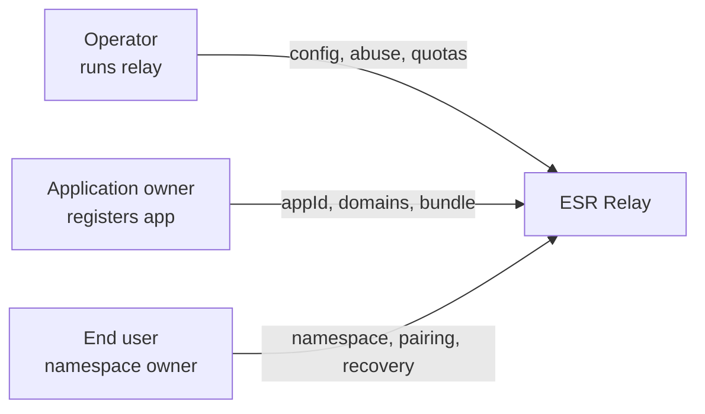
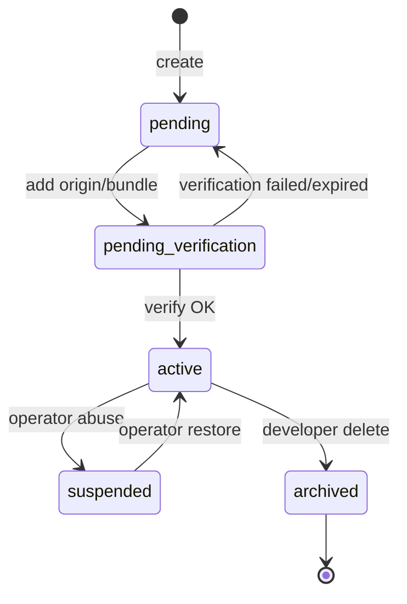
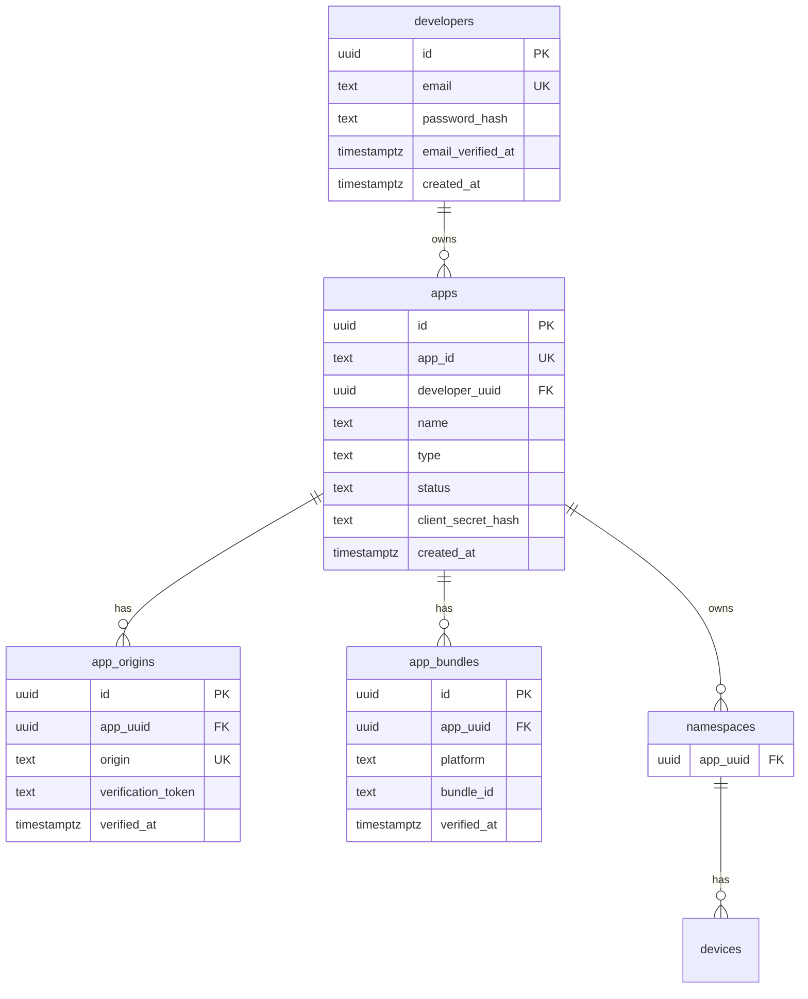

# 16 — Application Registry and Namespace Binding

| Field | Value |
|-------|-------|
| Status | **Spec v1.3 — implemented** (Phases 8a–8e; operator and developer portals) |
| Target spec version | **1.3.0** |
| Builds on | REST MVP (v1.0), WebSocket (v1.1), multi-document (v1.2) |
| API prefix | `/v1` (unchanged; additive endpoints) |
| Protocol magic | `ESR-DOC1` (unchanged) |

> **Türkçe:** [../tr/16-APP-REGISTRY.md](../tr/16-APP-REGISTRY.md)

---

## 1. Summary

Spec **v1.3** introduces an optional **Application Registry** layer above the existing device-token authentication model. Each registered application (`appId`) represents a consumer integration (web SPA, iOS app, Android app). **Namespaces are bound to exactly one app** when the feature is enabled.

The operator chooses how apps are registered via config:

| Mode | Who registers apps |
|------|-------------------|
| `disabled` | Feature off — v1.2 behaviour preserved |
| `operator_managed` | Operator only (YAML seed + admin API) |
| `self_service` | Application owners via developer portal + automated domain/bundle verification |

**Security boundary:**

- **App credentials** answer: *“Which integration may use this relay?”*
- **Device token + pairing/recovery** answer: *“Which user workspace may this device access?”*

App registration does **not** grant access to existing namespaces. Data access remains pairing/recovery-gated and E2EE-protected.

**Non-goals (v1.3):**

- End-user accounts for sync data (Alice still has no “Senkronla login”)
- OAuth provider / social login for namespace owners
- Cross-relay app federation
- `file://` origin support (out of scope; see §8.4)

---

## 2. Motivation

| Problem | v1.2 behaviour | v1.3 solution |
|---------|----------------|---------------|
| Unknown clients abuse public relay | IP rate limit only | Per-app quotas + suspend |
| Operator manually whitelists every integration | CORS static list | Dynamic CORS from verified app origins |
| No audit trail per integration | namespaceId in logs only | `appId` on namespaces, devices, requests |
| Hosted platform needs developer onboarding | Operator creates YAML entries | Self-service portal + DNS verification |
| Pairing open to any client presenting code | Code only | Optional `allowedAppIds` on pairing token |

---

## 3. Roles



| Role | Description | Registers |
|------|-------------|-----------|
| **Operator** | Owns relay deployment, config, admin token | Platform policy; apps in `operator_managed` mode |
| **Application owner (developer)** | Builds MyNotes, TodoApp, etc. | App + origins/bundle in `self_service` mode |
| **End user** | Alice syncing her workspace | Namespace via app client — **not** app registry |

---

## 4. Design principles

1. **Opt-in via config** — `apps.enabled: false` preserves full v1.2 compatibility.
2. **Layered auth** — App gate is additive; device token semantics unchanged.
3. **Namespace belongs to one app** — When enabled, every namespace has `app_uuid`; cross-app API access is rejected.
4. **Web trust = Origin + public appId** — No client secret for browser SPAs (Firebase/OAuth public client model).
5. **Native trust = bundle/package (+ optional secret or attestation)** — Origin header absent on native HTTP.
6. **Domain ownership is automated** — Self-service requires DNS TXT or HTTPS well-known verification; operator manual approve as fallback.
7. **Zero-knowledge preserved** — App layer sees metadata only; envelope payload rules unchanged.

---

## 5. Configuration

### 5.1 Full schema

```yaml
apps:
  # Master switch. false = v1.2 behaviour (no app checks, namespaces without app_uuid).
  enabled: false

  # How applications are registered (ignored when enabled: false).
  registrationMode: operator_managed   # operator_managed | self_service

  # Reject API/WS requests without valid app credentials (when enabled: true).
  requireRegistration: true

  # Development convenience — never true in production.
  allowLocalhostOrigins: false

  # Migration: assign existing namespaces (app_uuid IS NULL) to this app on read/write.
  # Used once when upgrading from v1.2. Remove after migration complete.
  legacyDefaultAppId: null

  verification:
    dnsRecordPrefix: "_esr-verify"       # _esr-verify.example.com TXT
    wellKnownPath: "/.well-known/esr-app-verification"
    challengeTtlSeconds: 86400             # pending origin expires
    fetchTimeoutSeconds: 10

  limits:
    perApp:
      namespacesPerDay: 100
      pairingTokensPerHour: 30
      recoverPerHour: 5
    perDeveloper:
      maxApps: 10                          # self_service only

  native:
    requireClientSecret: false             # confidential native clients
    requireManualReview: true              # bundle id pending until operator approves
    # Future: appAttestEnabled, playIntegrityEnabled

  developerPortal:
    enabled: false                         # schema field; runtime gate uses registrationMode + jwtSecret (see below)
    jwtSecret: "${ESR_DEVELOPER_JWT_SECRET}"
    sessionTtlHours: 168
    requireEmailVerification: true

  # operator_managed: seed apps at startup (merged with DB; DB wins on conflict).
  seed:
    - appId: esr_app_internal
      name: Internal Web App
      type: web
      status: active
      origins:
        - https://app.example.com
    - appId: esr_app_mobile
      name: Mobile Client
      type: native
      status: active
      bundleIds:
        ios: com.example.app
        android: com.example.app
      clientSecretHash: null               # optional SHA-256 of secret
```

### 5.2 Environment variables

Nested keys use `__` (see [07-SERVER-CONFIGURATION.md](./07-SERVER-CONFIGURATION.md) §3). Supported overrides in `load-config.ts`:

```bash
ESR_APPS__ENABLED=true
ESR_APPS__REGISTRATION_MODE=self_service          # operator_managed | self_service
ESR_APPS__REQUIRE_REGISTRATION=true
ESR_APPS__ALLOW_LOCALHOST_ORIGINS=false
ESR_APPS__LEGACY_DEFAULT_APP_ID=esr_app_primary   # v1.2 migration only
ESR_APPS__NATIVE__REQUIRE_CLIENT_SECRET=false
ESR_APPS__NATIVE__REQUIRE_MANUAL_REVIEW=true
ESR_APPS__DEVELOPER_PORTAL__JWT_SECRET=change-me-long-random-min-32-chars
ESR_DEVELOPER_JWT_SECRET=change-me-long-random-min-32-chars   # alias for jwtSecret above
ESR_APPS__LIMITS__PER_APP__NAMESPACES_PER_DAY=100
ESR_APPS__LIMITS__PER_APP__PAIRING_TOKENS_PER_HOUR=30
ESR_APPS__LIMITS__PER_APP__RECOVER_PER_HOUR=5
```

**YAML only (no env override today):** `verification.*`, `limits.perDeveloper.maxApps`, `developerPortal.enabled`, `developerPortal.sessionTtlHours`, `developerPortal.requireEmailVerification`, `seed[]`.

**Developer portal runtime:** The portal is available when `apps.enabled: true`, `registrationMode: self_service`, and `developerPortal.jwtSecret` is set (min 32 chars). The `developerPortal.enabled` field is stored in config but is **not** read by the server gate — use `registrationMode` + JWT secret instead.

### 5.3 Mode matrix

| `enabled` | `registrationMode` | Behaviour |
|-----------|-------------------|-----------|
| `false` | any | v1.2 — no `X-ESR-App-Id`, namespaces without app binding |
| `true` | `operator_managed` | Operator YAML seed + `POST /v1/admin/apps`; no developer portal |
| `true` | `self_service` | Developer portal + DNS/bundle verification; admin suspend only |

When `enabled: true` and `requireRegistration: true`:

- All public and device-authenticated endpoints require valid app context (§7).
- `POST /v1/namespaces` creates namespace **bound to requesting app**.
- Existing device tokens for namespaces of another app → `403 APP_NAMESPACE_MISMATCH`.

---

## 6. Application model

### 6.1 App types

| type | Identity signal | Verification |
|------|-----------------|--------------|
| `web` | `Origin` header (exact match) | DNS TXT or HTTPS well-known |
| `native` | `X-ESR-Bundle-Id` + `X-ESR-Platform: ios\|android\|desktop` | Manual review and/or client secret; future attestation |

### 6.2 Public identifiers

| Field | Format | Secret? |
|-------|--------|---------|
| `appId` | `esr_app_` + 12 char base32 | **No** — embedded in SDK |
| `clientSecret` | random 32+ bytes | **Yes** — native confidential only; stored hashed; **not assigned on app create** — only via `rotate-secret` |

Web SPAs must **not** use client secrets (extractable from bundle/HTML).

When `native.requireClientSecret: true`, unauthenticated endpoints (`POST /v1/namespaces`, pairing redeem, recover) require `X-ESR-Client-Secret` or the SDK `clientSecret` option. Relay `/health` exposes `apps.nativeRequireClientSecret` so portals can gate the secret UI.

### 6.3 App status state machine



| status | API access | Typical cause |
|--------|------------|---------------|
| `pending` | No — registration incomplete | App created; no origin/bundle yet |
| `pending_verification` | No — awaiting verification or approval | Web: origin not verified. Native: bundle pending operator approval (`requireManualReview`) |
| `active` | Yes | Web: at least one verified origin. Native: all bundles approved |
| `suspended` | No — `403 APP_SUSPENDED` | Operator suspended the app |
| `archived` | No — soft delete | Developer or operator archived |

---

## 7. Request authentication

### 7.1 Required headers (when `apps.enabled` + `requireRegistration`)

| Header | Required | Description |
|--------|----------|-------------|
| `X-ESR-App-Id` | Always | Public app identifier |
| `Origin` | Web clients | Browser-sent; must match registered origin |
| `X-ESR-Platform` | Native | `ios`, `android`, or `desktop` |
| `X-ESR-Bundle-Id` | Native | Bundle ID (iOS), package name (Android), or application ID (desktop) |
| `X-ESR-Client-Secret` | Native confidential | When `native.requireClientSecret: true` |
| `Authorization` | Device endpoints | Existing `Bearer {device_token}` — **not app registry**; identifies the paired device (§7.3) |

Optional telemetry (not security):

| Header | Example |
|--------|---------|
| `X-ESR-Client-Version` | `mynotes-web/1.2.0` |

### 7.2 Two auth layers

App registry and device tokens answer **different** questions:

| Layer | Headers | Question |
|-------|---------|----------|
| **Application** | `X-ESR-App-Id` + (`Origin` or native platform/bundle) [+ optional `X-ESR-Client-Secret`] | Which registered integration may use this relay? |
| **Device** | `Authorization: Bearer {device_token}` | Which paired device in which namespace? |

`POST /v1/namespaces` (first device) has no `device_token` yet — no `Authorization` header. The response includes `deviceToken`. Subsequent push/pull, pairing host routes, etc. require the device token — app headers remain mandatory when `apps.enabled` is true.

### 7.3 Validation algorithm

```
function validateAppContext(request):
  if !config.apps.enabled:
    return OK

  appId = header X-ESR-App-Id
  if missing: reject APP_ID_REQUIRED

  app = db.apps.findByAppId(appId)
  if !app: reject APP_NOT_FOUND
  if app.status != active: reject APP_SUSPENDED | APP_NOT_VERIFIED

  if app.type == web:
    origin = header Origin ?? parseRefererOrigin(Referer)  # Referer fallback weak
    if !origin: reject APP_ORIGIN_REQUIRED
    if config.apps.allowLocalhostOrigins && isLocalhost(origin):
      pass  # dev only
    else if origin not in app.verified_origins:
      reject APP_ORIGIN_NOT_ALLOWED

  if app.type == native:
    platform = header X-ESR-Platform
    bundleId = header X-ESR-Bundle-Id
    if !platform || !bundleId: reject APP_NATIVE_ID_REQUIRED
    if !app.bundle_ids.matches(platform, bundleId):
      reject APP_BUNDLE_NOT_ALLOWED
    if config.apps.native.requireClientSecret:
      secret = header X-ESR-Client-Secret
      if !constantTimeEquals(hash(secret), app.client_secret_hash):
        reject APP_CLIENT_SECRET_INVALID

  attach request.appContext = app
  return OK
```

### 7.4 Device token cross-check

After device auth middleware:

```
if config.apps.enabled:
  namespace = request.namespace
  if namespace.app_uuid != request.appContext.uuid:
    reject 403 APP_NAMESPACE_MISMATCH
```

### 7.5 Endpoint matrix

| Endpoint | App context | Device token | Notes |
|----------|-------------|--------------|-------|
| `POST /v1/namespaces` | Required | — | Sets `namespace.app_uuid` |
| `POST /v1/namespaces/.../devices` | Required | — | Pairing redeem |
| `POST /v1/namespaces/.../recover` | Required | — | Recovery |
| `POST /v1/namespaces/.../pairing-tokens` | Required | Yes | Optional `allowedAppIds` in body |
| Sync (`head`, `push`, `pull`) | Required | Yes | |
| WebSocket `/notifications` | Required (Origin) | Yes | Handshake |
| `GET /health` | No | — | |
| Admin `/v1/admin/*` | No | Admin token | |
| Developer `/v1/developer/*` | Developer JWT | — | self_service only |

### 7.6 Pairing scope (optional)

Host may restrict which apps can redeem a code:

```json
POST /v1/namespaces/{namespaceId}/pairing-tokens
{
  "ttlSeconds": 600,
  "allowedAppIds": ["esr_app_mynotes", "esr_app_mynotes_mobile"]
}
```

Guest redeem with non-listed `X-ESR-App-Id` → `403 APP_PAIRING_NOT_ALLOWED`.

Default (omit field): any **active** app may redeem (subject to operator policy).

---

## 8. Origin and domain verification

### 8.1 Exact origin rules

Registered origins are **full origins** including scheme and port:

```
https://app.example.com
https://app.example.com:8443
http://localhost:5173
http://127.0.0.1:3000
```

- No wildcards (`*.example.com` forbidden).
- `https` and `http` are distinct.
- Trailing slash not stored.

### 8.2 DNS TXT verification

Developer adds origin `https://notes.example.com` → server extracts host `notes.example.com`.

```
_esr-verify.notes.example.com  TXT  esr_verify=esr_app_abc123:<random_token>
```

Server polls DNS; on match → origin `verified_at = now()`, app may transition to `active` when all required origins verified.

### 8.3 HTTPS well-known verification

```
GET https://notes.example.com/.well-known/esr-app-verification
```

```json
{
  "appId": "esr_app_abc123",
  "token": "<same random token>"
}
```

Content-Type: `application/json`. TLS required (no HTTP except localhost dev).

### 8.4 Localhost development

When `allowLocalhostOrigins: true`:

- Origins matching `http://localhost:*` or `http://127.0.0.1:*` accepted without DNS verification.
- Recommended: separate dev app (`esr_app_mynotes_dev`) with only localhost origins.
- Production configs must set `allowLocalhostOrigins: false` (startup warning if true in production).

### 8.5 `file://` (explicitly unsupported)

Requests without `Origin` from non-native clients are rejected when app registry is enabled. Static `file://` pages cannot register a verifiable origin. Use local dev server (`http://localhost:5173`) instead.

---

## 9. Native applications (iOS / Android / desktop)

Native HTTP clients do not send a trustworthy `Origin`. Use `type: native` app registration.

### 9.1 Headers

**Application context** (native — app registry layer):

```http
X-ESR-App-Id: esr_app_mynotes_mobile
X-ESR-Platform: ios
X-ESR-Bundle-Id: com.example.mynotes
```

When `native.requireClientSecret: true`, also send:

```http
X-ESR-Client-Secret: {client_secret}
```

**Authenticated sync request** (application + paired device):

```http
X-ESR-App-Id: esr_app_mynotes_mobile
X-ESR-Platform: ios
X-ESR-Bundle-Id: com.example.mynotes
Authorization: Bearer dvt_...
```

`Authorization` is **not** app registry — it is the device token from §7.2. Omit it on the first `POST /v1/namespaces` call.

Android: `X-ESR-Platform: android`, package name in `X-ESR-Bundle-Id`.

Desktop (Electron, Tauri, etc.): `X-ESR-Platform: desktop`, application ID (e.g. `com.example.mynotes`) in `X-ESR-Bundle-Id`.

### 9.2 Verification tiers

| Tier | Mechanism | Spoof resistance |
|------|-----------|------------------|
| **A — Operator managed** | Operator adds bundle ID in YAML/admin | Low (header spoofing via curl) |
| **B — Confidential client** | `X-ESR-Client-Secret` on auth-less endpoints | Medium (secret in Keychain/Keystore) |
| **C — Attestation (future v1.4)** | App Attest / Play Integrity | High |

Tier A sufficient for self-hosted private relays. Tier B recommended for public hosted relays. Rate limits + suspend mitigate Tier A abuse.

### 9.3 Self-service native flow

1. Developer creates `type: native` app.
2. Adds iOS bundle ID, Android package name, and/or desktop application ID.
3. Status `pending_verification` until:
   - Operator manual approve (`requireManualReview: true`), or
   - Automated attestation (future).
4. `active` → native headers accepted.

### 9.4 SDK connect options

```typescript
await EsrSync.connect({
  relayUrl: 'https://sync.example.com',
  appId: 'esr_app_mynotes_mobile',
  appPlatform: 'ios',
  bundleId: 'com.example.mynotes',
  clientSecret: process.env.ESR_CLIENT_SECRET, // native confidential only
})
```

---

## 10. Namespace binding

### 10.1 Rule

When `apps.enabled: true`:

- Every namespace row has non-null `app_uuid` FK → `apps.id`.
- `(namespace_id)` remains globally unique (UUID v4).
- Logical isolation: namespace `N` created by app `A` is accessible only when request app context matches `A`.

Same human may use two apps → two independent namespace universes (different `namespaceId` values).

### 10.2 Create namespace (updated)

```http
POST /v1/namespaces
X-ESR-App-Id: esr_app_mynotes
Origin: https://notes.example.com
```

Body unchanged (v1.2). Response adds:

```json
{
  "namespaceId": "...",
  "appId": "esr_app_mynotes",
  "deviceToken": "...",
  ...
}
```

Server sets `namespaces.app_uuid` from validated app context.

### 10.3 Recovery

Recovery must present app context matching namespace's app. Wrong app → `403 APP_NAMESPACE_MISMATCH` (not `401 RECOVERY_INVALID` — avoid oracle).

### 10.4 Cross-app migration

**Not supported in v1.3.** Moving a namespace between apps requires operator tooling (export/import head blobs) — out of scope.

---

## 11. Dynamic CORS

When `apps.enabled: true`, static `cors.allowedOrigins` becomes fallback only:

```typescript
cors.origin = (origin, callback) => {
  if (!config.apps.enabled) {
    return staticList(origin)
  }
  if (!origin) return callback(null, false)  // non-browser
  if (config.apps.allowLocalhostOrigins && isLocalhost(origin)) {
    return callback(null, true)
  }
  const app = appRegistry.findActiveByOrigin(origin)
  if (app) return callback(null, origin)  // echo exact origin
  return callback(null, false)
}
```

WebSocket handshake validates `Origin` identically.

---

## 12. Developer portal (self_service)

Enabled when `registrationMode: self_service` (overrides `developerPortal.enabled`).

### 12.1 Developer account

Separate from end-user sync identity. Stores email, password hash (or OAuth later), verification state.

**Not** the same as namespace owner — a developer registers the integration; Alice uses the app.

### 12.2 API surface

Base: `/v1/developer`

| Method | Path | Auth | Description |
|--------|------|------|-------------|
| POST | `/register` | — | Create developer account |
| POST | `/login` | — | JWT session |
| POST | `/logout` | JWT | Invalidate session |
| GET | `/me` | JWT | Profile |
| POST | `/apps` | JWT | Create app → `pending` |
| GET | `/apps` | JWT | List own apps |
| GET | `/apps/:appId` | JWT | Detail + origins/bundles |
| PATCH | `/apps/:appId` | JWT | Update name (not appId) |
| POST | `/apps/:appId/origins` | JWT | Add web origin → challenge token |
| POST | `/apps/:appId/origins/:originId/verify` | JWT | Trigger DNS/HTTPS check |
| DELETE | `/apps/:appId/origins/:originId` | JWT | Remove origin |
| POST | `/apps/:appId/bundles` | JWT | Add iOS/Android/desktop bundle |
| DELETE | `/apps/:appId` | JWT | Archive app |
| POST | `/apps/:appId/rotate-secret` | JWT | Create or rotate native secret (plaintext only in response) |

Admin API (`/v1/admin/apps`) remains for suspend, quota override, manual native approve.

### 12.3 Approval flows and client secret

#### Web applications

1. Developer or operator creates `type: web` app → `pending`
2. Adds HTTPS origin → `pending_verification`
3. DNS TXT or `/.well-known/esr-app-verification` verification → origin `verified_at` set
4. Service transitions to `active` → sync API accepts requests

Portal: developer `/developer` or operator `/operator` → Apps → verify origin.

#### Native applications (iOS / Android / desktop)

1. Create `type: native` app → `pending`
2. Add platform + bundle ID (`ios`, `android`, `desktop`) → `pending_verification`
3. When `native.requireManualReview: true` (default), operator approves bundle (`POST .../bundles/:id/approve` or portal **Approve**)
4. All bundles approved → `active`

Portal shows `pending_verification` for native apps as **Pending approval** (distinct from web origin verification wording).

#### Client secret lifecycle

| Step | Behaviour |
|------|-----------|
| App create | `client_secret_hash` is **NULL** — no automatic secret |
| Relay config | `native.requireClientSecret: true` → secret required on unauthenticated endpoints |
| Create / rotate | `POST /v1/developer/apps/:appId/rotate-secret` or operator portal **Generate secret** |
| SDK | `EsrSync.connect({ clientSecret })` or `X-ESR-Client-Secret` header |
| Portal UI | Shown only when `/health` → `apps.nativeRequireClientSecret: true`, app `active`, at least one bundle, **all bundles approved** |
| Security | Never embed in web builds; use Keychain / Keystore / server env |

Rotating invalidates the previous hash immediately.

---

## 13. Operator admin API (operator_managed + oversight)

Base: `/v1/admin/apps` — requires `admin_api_token`.

| Method | Path | Description |
|--------|------|-------------|
| POST | `/apps` | Create app (skip portal) |
| GET | `/apps` | List all |
| GET | `/apps/:appId` | Detail |
| PATCH | `/apps/:appId` | status, quotas |
| POST | `/apps/:appId/origins` | Add verified origin directly |
| POST | `/apps/:appId/bundles/:id/approve` | Approve native bundle |
| DELETE | `/apps/:appId` | Archive |

---

## 14. Data model

### 14.1 ER diagram (additions)



When `apps.enabled: false`, `namespaces.app_uuid` is nullable.

### 14.2 Migration `006_app_registry.sql` (reference)

```sql
CREATE TABLE developers (
  id UUID PRIMARY KEY DEFAULT gen_random_uuid(),
  email TEXT NOT NULL UNIQUE,
  password_hash TEXT NOT NULL,
  email_verified_at TIMESTAMPTZ,
  created_at TIMESTAMPTZ NOT NULL DEFAULT now()
);

CREATE TABLE apps (
  id UUID PRIMARY KEY DEFAULT gen_random_uuid(),
  app_id TEXT NOT NULL UNIQUE,
  developer_uuid UUID REFERENCES developers(id) ON DELETE SET NULL,
  name TEXT NOT NULL,
  type TEXT NOT NULL CHECK (type IN ('web', 'native')),
  status TEXT NOT NULL DEFAULT 'pending',
  client_secret_hash TEXT,
  created_at TIMESTAMPTZ NOT NULL DEFAULT now(),
  updated_at TIMESTAMPTZ NOT NULL DEFAULT now()
);

CREATE TABLE app_origins (
  id UUID PRIMARY KEY DEFAULT gen_random_uuid(),
  app_uuid UUID NOT NULL REFERENCES apps(id) ON DELETE CASCADE,
  origin TEXT NOT NULL,
  verification_token TEXT NOT NULL,
  verified_at TIMESTAMPTZ,
  created_at TIMESTAMPTZ NOT NULL DEFAULT now(),
  UNIQUE (app_uuid, origin)
);

CREATE TABLE app_bundles (
  id UUID PRIMARY KEY DEFAULT gen_random_uuid(),
  app_uuid UUID NOT NULL REFERENCES apps(id) ON DELETE CASCADE,
  platform TEXT NOT NULL CHECK (platform IN ('ios', 'android', 'desktop')),
  bundle_id TEXT NOT NULL,
  verified_at TIMESTAMPTZ,
  created_at TIMESTAMPTZ NOT NULL DEFAULT now(),
  UNIQUE (app_uuid, platform, bundle_id)
);

ALTER TABLE namespaces
  ADD COLUMN app_uuid UUID REFERENCES apps(id) ON DELETE RESTRICT;

CREATE INDEX idx_namespaces_app_uuid ON namespaces(app_uuid);

ALTER TABLE pairing_tokens
  ADD COLUMN allowed_app_ids TEXT[] DEFAULT NULL;
```

### 14.3 Pairing token column

`allowed_app_ids`: nullable text array of public `app_id` strings. NULL = no restriction.

---

## 15. Rate limits and quotas

New rate-limit scopes:

| action id | Scope | Default |
|-----------|-------|---------|
| `namespace_create` | per `app_id` + IP | from `apps.limits.perApp.namespacesPerDay` |
| `pairing_token` | per `app_id` | existing + app dimension |
| `global_ip` | per IP | unchanged |

Exceeded app quota → `429 RATE_LIMIT_EXCEEDED` with `details.appId`.

Operator suspend → immediate `403 APP_SUSPENDED` (no grace period).

---

## 16. Security

### 16.1 Threat model additions

| Threat | Mitigation |
|--------|------------|
| Unregistered client spam | `requireRegistration` + per-app quotas |
| Domain hijack in registry | DNS/HTTPS verification before `active` |
| Spoof Origin via curl | Irrelevant for browser users; rate limit non-browser |
| Stolen appId | Without domain/bundle match, useless for web |
| Stolen clientSecret | Rotate via developer portal; native only |
| Cross-app namespace probe | `APP_NAMESPACE_MISMATCH` uniform timing |
| Developer portal abuse | Email verify, captcha, per-developer app limit |

### 16.2 What app registry does NOT protect

- Payload confidentiality (still E2EE + zero-knowledge)
- Unauthorized namespace access (still pairing/recovery)
- Operator metadata visibility (unchanged)

### 16.3 Logging

May log: `appId`, `origin`, `platform`, `bundleId` (not secret).

Never log: `clientSecret`, verification tokens in production info logs.

---

## 17. Error codes (new)

| HTTP | code | Description |
|------|------|-------------|
| 400 | APP_ID_REQUIRED | Missing `X-ESR-App-Id` |
| 400 | APP_ORIGIN_REQUIRED | Web request without Origin |
| 400 | APP_NATIVE_ID_REQUIRED | Native headers incomplete |
| 401 | APP_CLIENT_SECRET_INVALID | Wrong native secret |
| 403 | APP_NOT_FOUND | Unknown appId |
| 403 | APP_NOT_VERIFIED | App not yet active |
| 403 | APP_SUSPENDED | Operator suspended app |
| 403 | APP_ORIGIN_NOT_ALLOWED | Origin not registered |
| 403 | APP_BUNDLE_NOT_ALLOWED | Bundle/package mismatch |
| 403 | APP_NAMESPACE_MISMATCH | Namespace belongs to another app |
| 403 | APP_PAIRING_NOT_ALLOWED | App not in allowedAppIds |
| 409 | APP_ORIGIN_EXISTS | Duplicate origin registration |
| 409 | APP_BUNDLE_EXISTS | Duplicate bundle |

Full list merged into [12-ERROR-CODES.md](./12-ERROR-CODES.md).

---

## 18. SDK and client changes

### 18.1 `EsrSync.connect` new options

```typescript
interface EsrSyncOptions {
  relayUrl: string
  appId?: string                    // required when relay has apps.enabled
  appPlatform?: 'web' | 'ios' | 'android' | 'desktop'
  bundleId?: string
  clientSecret?: string
  clientVersion?: string
}
```

SDK automatically sets headers on `RelayClient` and `NotificationClient`.

### 18.2 Breaking change policy

| Relay config | Old SDK without appId |
|--------------|----------------------|
| `apps.enabled: false` | Works |
| `apps.enabled: true` | Fails with `APP_ID_REQUIRED` — SDK upgrade required |

### 18.3 Agent integration docs

Update `apps/web/public/agents/*.md` with app registration section when implementing.

---

## 19. Migration from v1.2

### 19.1 Upgrade path

1. Deploy v1.3 server with `apps.enabled: false` — no behaviour change.
2. Create seed apps via admin API or YAML.
3. Set `legacyDefaultAppId` to primary app.
4. Run migration job: `UPDATE namespaces SET app_uuid = ... WHERE app_uuid IS NULL`.
5. Enable `apps.enabled: true`, `requireRegistration: true`.
6. Release SDK with mandatory `appId` for that relay.
7. Remove `legacyDefaultAppId` after verification.

### 19.2 Self-hosted default recommendation

```yaml
apps:
  enabled: true
  registrationMode: operator_managed
  requireRegistration: true
  allowLocalhostOrigins: false   # true in dev config overlay only
  seed:
    - appId: esr_app_primary
      name: My Organization Apps
      type: web
      status: active
      origins:
        - https://app.example.com
```

---

## 20. Implementation plan

### Phase A — Core registry (5–7 days)

- [ ] Migration `006_app_registry.sql`
- [ ] Config schema + seed loader
- [ ] App context middleware (web Origin + native bundle)
- [ ] Namespace `app_uuid` on create; cross-check on device auth
- [ ] Dynamic CORS
- [ ] Error codes + tests
- [ ] SDK header injection + `appId` option

**Done when:** operator_managed web app can create namespace; wrong origin rejected.

### Phase B — Operator admin API (2–3 days)

- [ ] CRUD `/v1/admin/apps`
- [ ] Manual origin/bundle approve
- [ ] Suspend / restore
- [ ] Startup seed merge

**Done when:** apps manageable without DB access.

### Phase C — Domain verification (3–4 days)

- [ ] DNS TXT + HTTPS well-known checkers
- [ ] Challenge token rotation
- [ ] `allowLocalhostOrigins` dev path

**Done when:** automated web origin verification e2e test passes.

### Phase D — Developer portal (5–7 days)

- [ ] Developer auth (register/login JWT)
- [ ] Self-service app CRUD
- [ ] Email verification
- [ ] Per-developer quotas

**Done when:** `registrationMode: self_service` end-to-end without operator.

### Phase E — Native + pairing scope (3–4 days)

- [ ] Native bundle registration + manual approve
- [ ] Optional client secret
- [ ] `allowedAppIds` on pairing tokens
- [ ] WS Origin validation

**Done when:** iOS/Android integration test with operator-managed bundle.

### Phase F — Documentation and OpenAPI (2 days)

- [ ] OpenAPI paths for developer/admin app endpoints
- [ ] Update agent docs, OPERATOR.md, CHANGELOG
- [ ] Postman collection

---

## 21. Acceptance criteria

- [ ] `apps.enabled: false` — all v1.2 integration tests pass unchanged
- [ ] `operator_managed` — operator creates app; client with matching origin syncs
- [ ] Wrong origin → `403 APP_ORIGIN_NOT_ALLOWED`
- [ ] Namespace created under app A inaccessible with app B credentials
- [ ] `self_service` — developer verifies domain; app reaches `active` without operator
- [ ] Localhost dev works with `allowLocalhostOrigins: true`
- [ ] Pairing with `allowedAppIds` blocks wrong app
- [ ] Dynamic CORS reflects verified origins only
- [ ] No client secret in web SDK path
- [ ] Migration assigns legacy namespaces via `legacyDefaultAppId`

---

## 22. Related documents

| Document | Update needed |
|----------|---------------|
| [04-API-REFERENCE.md](./04-API-REFERENCE.md) | App headers, new endpoints, namespace response |
| [07-SERVER-CONFIGURATION.md](./07-SERVER-CONFIGURATION.md) | `apps` config block |
| [08-SECURITY.md](./08-SECURITY.md) | App layer threat model |
| [10-DATA-MODEL.md](./10-DATA-MODEL.md) | New tables, namespace FK |
| [11-IMPLEMENTATION-PLAN.md](./11-IMPLEMENTATION-PLAN.md) | Phase A–F |
| [12-ERROR-CODES.md](./12-ERROR-CODES.md) | App error codes |
| [14-ESR-SYNC-FACADE.md](./14-ESR-SYNC-FACADE.md) | `appId` connect option |

---

## 23. Version history

| Version | Change |
|---------|--------|
| **1.3.0** | Application registry, namespace–app binding, operator/self-service registration modes |
| 1.2.0 | Multi-document per namespace |
| 1.1.0 | WebSocket notifications |
| 1.0.x | Initial ESR MVP |
