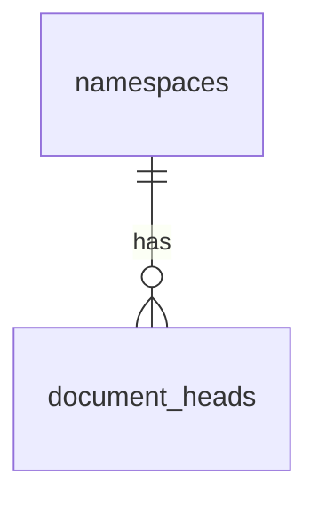

# 15 — Namespace Başına Çoklu Döküman

| Alan | Değer |
|------|--------|
| Durum | **Spec v1.2 — yayında** (sunucu, istemci SDK, dokümantasyon, operatör rehberi) |
| Onay tarihi | 2026-05-29 |
| Spec sürümü | **1.2.0** (çoklu belge v1 kapsamında) |
| API prefix | `/v1` (değişmez; geriye dönük uyumlu genişleme) |
| Protokol magic | `ESR-DOC1` (değişmez) |
| Zarf `schemaVersion` | `1` = yalnızca primary; `2` = serbest `documentId` |
| Bağımlılık | v1.1.0 (REST + WS bildirimleri) |

> **English:** [../en/15-MULTI-DOCUMENT.md](../en/15-MULTI-DOCUMENT.md)

---

## 1. Özet

**Spec v1.2**, namespace başına bir veya daha fazla bağımsız snapshot döküman tanımlar (ör. `primary`, `settings`, `vault-notes`). Her dökümanın kendi revizyon zinciri, head'i, blob yolu ve çakışma yüzeyi vardır. Veritabanı `PRIMARY KEY (namespace_uuid, document_id)` kullanır.

**Geriye dönük uyumluluk:** Yalnızca `primary` ve zarf `schemaVersion: 1` kullanan eski entegrasyonlar değişmeden çalışmaya devam eder.

**Kapsam dışı:**

- Entity düzeyinde CRDT birleştirme (hâlâ istemci tarafı snapshot)
- Döküman verisinin WebSocket üzerinden taşınması
- Dökümanlar arası atomik işlem
- Relay'ler arası federasyon
- Kullanıcı hesabı / OAuth

---

## 2. Motivasyon

| Kullanım | Tek belge geçici çözümü | Çoklu belge faydası |
|----------|------------------|------------|
| Ayarlar + ana veri | Tek `primary` JSON iç içe anahtarlar | Ayrı push/pull/conflict |
| Büyük snapshot + küçük config | Her değişiklikte tam yükleme | Daha küçük zarflar |
| Döküman bazlı özellik | Özel payload şeması | Yerel `documentId` yönlendirme |
| Operatör görünürlüğü | Admin tek head | Tüm head'lerin listesi |

v1 geçerli kalır: tek snapshot yeterli uygulamalar `primary` ile migration yapmadan devam eder.

---

## 3. Tasarım ilkeleri

1. **Varsayılan geriye dönük uyumluluk** — `/documents/primary/*` ve `schemaVersion: 1` zarfları çalışmaya devam eder.
2. **Döküman başına aynı sync semantiği** — revizyon, 409 çakışma, zero-knowledge zarf değişmez; yalnızca `documentId` parametrik olur.
3. **Aptal sunucu, akıllı istemci** — sunucu dökümanlar arası birleştirme yapmaz.
4. **Lazy döküman oluşturma** — ilk başarılı PUT'a kadar head satırı yok (v1 `primary` ile aynı).
5. **Artımlı yayın** — sunucu çoklu döküman SDK'sından önce ship edilebilir; SDK, uygulama ikinci dökümanı kullanmadan önce ship edilebilir.

---

## 4. `documentId` kuralları

### 4.1 Format

```
documentId ::= [a-z][a-z0-9_-]{0,62}
```

| Kural | Değer |
|-------|-------|
| Min uzunluk | 1 |
| Max uzunluk | 64 |
| Karakter kümesi | küçük harf ASCII, rakam, `_`, `-` |
| İlk karakter | `a`–`z` |
| Rezerve | `primary` (her zaman geçerli; v1 varsayılanı) |

Doğrulama: URL path segmenti, zarf alanı, blob key segmenti, WS mesajları.

### 4.2 Örnekler

| Geçerli | Geçersiz | Neden |
|---------|----------|-------|
| `primary` | `Primary` | büyük harf |
| `settings` | `settings/` | slash |
| `vault_notes` | `` | boş |
| `a` | `1settings` | harf ile başlamalı |
| `notes-v2` | `notes.v2` | nokta yasak |

### 4.3 Sunucu politikası (opsiyonel)

```yaml
sync:
  maxDocumentsPerNamespace: 32   # 0 = sınırsız (varsayılan 32)
  revisionRetentionDays: 0       # 0 = hepsini tut; push sonrası N günden eski head-dışı revizyonları otomatik sil
  revisionRetentionCount: 0      # 0 = kapalı; belge başına son N revizyonu tut (head N'ye dahil)
  allowedDocumentIds: []         # boş = geçerli her id; dolu = allowlist
```

Limit aşımı: `403` + `DOCUMENT_LIMIT_REACHED`.

---

## 5. Protokol (ESR-DOC1)

### 5.1 Zarf sürümleri

| `schemaVersion` | `documentId` alanı | Sunucu |
|-----------------|-------------------|--------|
| `1` | `"primary"` olmalı | Aksi `422 ENVELOPE_INVALID` |
| `2` | §4'e uygun herhangi bir id | Kabul; PUT'ta path ile eşleşmeli |

`magic` değişmez: `ESR-DOC1`.

### 5.2 Zarf örneği (`documentId` ≠ `primary`)

```json
{
  "magic": "ESR-DOC1",
  "schemaVersion": 2,
  "namespaceId": "550e8400-e29b-41d4-a716-446655440000",
  "namespaceLabel": "Çalışma Alanım",
  "documentId": "settings",
  "revision": "01JABCDEF...",
  "deviceId": "f47ac10b-58cc-4372-a567-0e02b2c3d479",
  "writtenAt": "2026-05-29T12:00:00.000Z",
  "contentType": "application/vnd.example.settings+json",
  "contentMagic": "ENV-ENC1",
  "contentSha256": "abc...",
  "payload": "..."
}
```

### 5.3 `verifyEnvelope` seçenekleri

```typescript
verifyEnvelope(envelope, {
  namespaceId: '...',
  documentId: 'settings',  // PUT'ta path {documentId} ile zorunlu
})
```

### 5.4 Zod taslağı (`packages/protocol`)

```typescript
const DocumentIdV2 = z.string().regex(/^[a-z][a-z0-9_-]{0,62}$/)

export const EsrDocEnvelopeV1Schema = EsrDocEnvelopeSchema // documentId: literal('primary')

export const EsrDocEnvelopeV2Schema = EsrDocEnvelopeSchema.extend({
  schemaVersion: z.literal(2),
  documentId: DocumentIdV2,
})

export const EsrDocEnvelopeSchema = z.discriminatedUnion('schemaVersion', [
  EsrDocEnvelopeV1Schema,
  EsrDocEnvelopeV2Schema,
])
```

### 5.5 Fixture'lar (yeni)

`packages/protocol/fixtures/multi-document/` altında:

- `valid-settings.json`
- `invalid-document-id-uppercase.json`
- `v1-still-valid-primary.json`

---

## 6. REST API

Tüm yollar **`/v1`** altında kalır. Çoklu döküman için `/v2` API prefix yok ([11-IMPLEMENTATION-PLAN.md](./11-IMPLEMENTATION-PLAN.md) §7: kırıcı değişiklikler `/v2`; bu additive genişleme).

### 6.1 Yeni uçlar

#### Döküman head listesi

```http
GET /v1/namespaces/{namespaceId}/documents
Authorization: Bearer {device_token}
```

**200 yanıt:**

```json
{
  "documents": [
    {
      "documentId": "primary",
      "revision": "01J...",
      "writtenAt": "2026-05-29T12:00:00.000Z",
      "contentSha256": "...",
      "contentMagic": "ENV-ENC1",
      "sizeBytes": 4096,
      "writerDeviceId": "01JF..."
    },
    {
      "documentId": "settings",
      "revision": "01K...",
      ...
    }
  ]
}
```

Henüz push yoksa: `{ "documents": [] }`.

#### Parametrik döküman rotaları

| Method | Path |
|--------|------|
| GET | `/v1/namespaces/{namespaceId}/documents/{documentId}/head/meta` |
| GET | `/v1/namespaces/{namespaceId}/documents/{documentId}/head` |
| PUT | `/v1/namespaces/{namespaceId}/documents/{documentId}` |

İstek/yanıt gövdeleri v1 `primary` uçları ile aynı; zarf `documentId` path segmenti ile eşleşmeli.

### 6.2 Legacy alias'lar (zorunlu)

Bu yollar **süresiz** korunur:

```
GET  /v1/namespaces/{namespaceId}/documents/primary/head/meta
GET  /v1/namespaces/{namespaceId}/documents/primary/head
PUT  /v1/namespaces/{namespaceId}/documents/primary
```

Uygulama: route alias veya `documentId = 'primary'` ile paylaşılan handler.

### 6.3 Namespace info yanıtı

`GET /v1/namespaces/{namespaceId}` — opsiyonel çoklu head özeti:

```json
{
  "namespaceId": "...",
  "namespaceLabel": "...",
  "limits": { ... },
  "head": { ... },
  "documents": [ { "documentId": "primary", ... }, ... ]
}
```

| Alan | Eski istemci | Çoklu belge |
|------|---------------|-----|
| `head` | Primary head meta (değişmez) | `documents` içinde `documentId === 'primary'` varsa aynı |
| `documents` | Varsa yok sayılır | Tam liste |

### 6.4 Push doğrulama

1. Zarf parse (`schemaVersion` 1 veya 2).
2. Path `documentId` ile `verifyEnvelope`.
3. Zarf `documentId` === path `documentId`.
4. Rate limit: tüm belge `PUT` istekleri cihaz başına tek `put_document` kotasını paylaşır (varsayılan 120/saat); JSON anahtarı `put_document`, başlıklar `RateLimit-PutDocument-*`. Belge başına ayrı bucket henüz yok.

### 6.5 Yeni hata kodları

| HTTP | `code` | Durum |
|------|--------|-------|
| 400 | `INVALID_DOCUMENT_ID` | Path/id §4 regex'i geçmiyor |
| 403 | `DOCUMENT_LIMIT_REACHED` | `maxDocumentsPerNamespace` aşıldı |
| 403 | `DOCUMENT_ID_NOT_ALLOWED` | Allowlist'te id yok |
| 422 | `ENVELOPE_DOCUMENT_MISMATCH` | Zarf `documentId` ≠ path |

---

## 7. Blob depolama

### 7.1 Key formatı

```
{namespaceId}/{documentId}/{revision}.json
```

Örnek: `550e8400-e29b-41d4-a716-446655440000/settings/01JABC....json`

### 7.2 Regex (v1'in yerine)

```regex
^[0-9a-f]{8}-[0-9a-f]{4}-[0-9a-f]{4}-[0-9a-f]{4}-[0-9a-f]{12}/[a-z][a-z0-9_-]{0,62}/[A-Za-z0-9_-]+\.json$
```

Mevcut v1 blob'lar `.../primary/...` altında geçerli kalır; dosya migrasyonu gerekmez.

### 7.3 `buildBlobKey`

```typescript
buildBlobKey(namespaceId: string, documentId: string, revision: string): string
```

---

## 8. Veri modeli

### 8.1 Mevcut tablolar (MVP için migrasyon gerekmez)

`document_heads` zaten namespace başına çoklu satıra izin veriyor. Servis katmanı `document_id = 'primary'` filtresini kaldırır.

### 8.2 ER diyagramı 



v1'deki `||--o|` (sıfır veya bir) → `||--o{` (sıfır veya çok).

### 8.3 Opsiyonel: `document_registry` (faz 2)

MVP için gerekli değil. İleride:

```sql
CREATE TABLE document_registry (
  namespace_uuid UUID NOT NULL REFERENCES namespaces(id) ON DELETE CASCADE,
  document_id TEXT NOT NULL,
  label TEXT,
  created_at TIMESTAMPTZ NOT NULL DEFAULT now(),
  PRIMARY KEY (namespace_uuid, document_id)
);
```

Döküman silme (DELETE) ayrı RFC'de.

### 8.4 `document_revisions` geçmişi

Yayında. Her push bir satır ekler; `document_heads` güncel head olarak kalır. Blob'lar revizyon başına saklanır (aynı cihaz reuse yok).

**Otomatik retention** (`sync.revisionRetentionDays`, `sync.revisionRetentionCount` — env `ESR_REVISION_RETENTION_DAYS`, `ESR_REVISION_RETENTION_COUNT`):

- **Gün:** push sonrası o namespace ve belge için N günden eski head-dışı revizyonları sil. Varsayılan `0` (hepsini tut).
- **Sayı:** push sonrası belge başına son N revizyonu tut; güncel head N'ye dahildir. Varsayılan `0` (kapalı).

**Manuel temizlik:** operatör paneli **Revizyonlar** (namespace, uygulama veya genel ayarlarda tüm relay) veya admin API `GET /v1/admin/settings/sync` + `POST /v1/admin/revisions/purge` (`mode: date` + `before` veya `mode: count` + `keepLastRevisions`; kapsam `deployment`, `namespace` veya `app`). Tarih modunda güncel head korunur; sayı modunda head saklanan N'ye dahildir.

Bkz. [10-DATA-MODEL.md](./10-DATA-MODEL.md) §11 ve [OPERATOR.md](../../OPERATOR.md).

---

## 9. WebSocket bildirimleri

### 9.1 `head_changed` 

```json
{
  "type": "head_changed",
  "documentId": "settings",
  "revision": "01J...",
  "contentSha256": "...",
  "writtenAt": "2026-05-29T12:00:00.000Z",
  "writerDeviceId": "01JF..."
}
```

v1 istemciler: yalnızca `documentId: "primary"` görür (davranış değişmez).

### 9.2 İstemci subscribe filtresi (opsiyonel)

`auth_ok` sonrası:

```json
{
  "type": "subscribe",
  "documentIds": ["primary", "settings"]
}
```

| `documentIds` | Davranış |
|---------------|----------|
| yok | Namespace'teki tüm `head_changed` (varsayılan) |
| `["primary"]` | Yalnızca primary |
| `[]` | Geçersiz |

Sunucu broadcast'i socket aboneliğine göre filtreler. v1 istemci subscribe göndermezse tüm olayları alır.

### 9.3 Bildirim sonrası pull

```http
GET .../documents/{documentId}/head/meta
```

`NotificationClient`, `head_changed.documentId` → pull hedefi eşlemesi yapar.

---

## 10. İstemci SDK (`@senkronla/client`)

### 10.1 Faz A — `RelayClient` (düşük seviye)

Tüm döküman metodlarına opsiyonel `documentId`; varsayılan `'primary'`.

```typescript
getHeadMeta(namespaceId: string, documentId = 'primary')
getHead(namespaceId: string, documentId = 'primary')
pushDocument({ namespaceId, documentId = 'primary', envelope, expectedRevision })
listDocuments(namespaceId: string)
```

`primary` dışı id için `buildEnvelope({ documentId, schemaVersion: 2, ... })`.

### 10.2 Faz B — `SyncStateStore`

Depolama anahtarları namespace + döküman kapsamlı:

```
{namespaceId}:{documentId}:knownRemoteRevision
```

`deviceToken` namespace kapsamlı kalır (aynı cihaz).

Migrasyon: ilk çalıştırmada `{namespaceId}:knownRemoteRevision` → `{namespaceId}:primary:knownRemoteRevision` kopyala (yeni anahtar yoksa).

### 10.3 Faz C — `EsrSync` (önerilen API)

**Spec kararı: çoklu döküman connect**

```typescript
EsrSync.connect({
  relayUrl: '...',
  storage: esrStorage,
  namespaceId: '...',
  documents: [
    { documentId: 'primary', adapter: mainAdapter },
    { documentId: 'settings', adapter: settingsAdapter },
  ],
  onConflict: (ctx) => { ... },  // ctx.documentId içerir
  ...
})
```

İçeride: döküman girişi başına bir `SyncEngine`; paylaşılan `RelayClient`, WS, device token.

| Konu | Yaklaşım |
|------|----------|
| WS bağlantısı | Namespace başına tek |
| Push debounce | Döküman başına |
| Durum | Birleşik + opsiyonel `onDocumentStatusChange?` |
| Zamanlayıcı | Tek döngü; tüm dökümanları kontrol |

**v1 kısayolu korunur:**

```typescript
EsrSync.connect({
  document: mainAdapter,  // documents: [{ documentId: 'primary', adapter }] anlamına gelir
  ...
})
```

### 10.4 Çakışma

`ConflictContext`'e `documentId: string` eklenir. UI hangi dökümanda çakışma olduğunu göstermeli.

---

## 11. Geriye dönük uyumluluk matrisi

| İstemci | Sunucu | Sonuç |
|---------|--------|--------|
| Primary-only | Eski relay | Değişmez |
| Primary-only | Güncel relay (v1.2) | `/primary` alias ile tam destek |
| Çoklu belge | Eski relay | Yalnızca `primary`; ikinci döküman push başarısız |
| Çoklu belge | Güncel relay (v1.2) | Tam çoklu döküman |

| Zarf | Eski sunucu | Güncel sunucu |
|------|-----------|-----------|
| `schemaVersion: 1`, `documentId: primary` | OK | OK |
| `schemaVersion: 2`, `documentId: settings` | `422` | OK |

---

## 12. Güvenlik ve kötüye kullanım

- **Rate limit:** Her başarılı push (her `documentId`) aynı cihaz başına `put_document` kotasından düşer (`rateLimits` içinde belge başına anahtar yok).
- **Depolama:** `maxDocumentsPerNamespace` satır sayısını sınırlar; `revisionRetentionDays` / `revisionRetentionCount` eski revizyon blob'larını push sonrası kısaltır.
- **Blob traversal:** §7.2 regex.
- **Dökümanlar arası yetki yok:** Device token namespace'teki tüm dökümanlara erişir (v1 primary ile aynı). İnce taneli ACL kapsam dışı.

---

## 13. Uygulama fazları

### Faz 0 — Spec ve OpenAPI (bu belge)

- [x] Spec onayı (2026-05-29)
- [x] `docs/envelope-sync-relay/openapi.yaml` güncelleme
- [ ] README, OVERVIEW, PROTOCOL çapraz link

### Faz 1 — Sunucu çekirdek (~3–5 gün)

- [x] Parametrik rotalar + `/primary` (`:documentId` üzerinden)
- [x] `document-service` parametrik SQL
- [x] Blob `buildBlobKey` + regex
- [x] Zarf `schemaVersion: 2` parse/verify
- [x] `GET .../documents` listesi
- [x] Entegrasyon testleri: aynı namespace'te iki döküman (`multi-document.integration.test.ts`)
- [ ] Admin panel: namespace listesinde `documentCount`

### Faz 2 — WebSocket (~2 gün)

- [x] `head_changed.documentId` her geçerli id
- [x] Opsiyonel subscribe filtresi (`subscribe.documentIds`)
- [x] `NotificationClient` pull yönlendirme + auth sonrası subscribe

### Faz 3 — İstemci SDK (~5–8 gün)

- [x] `RelayClient` documentId parametresi + `listDocuments`
- [x] `buildEnvelope` schemaVersion 2 (primary dışı id'ler)
- [x] `SyncStateStore` kapsamlı anahtarlar + migrasyon
- [x] `EsrSync` çoklu connect (`documents[]`, `notifyLocalChange(id)`)
- [x] `NotificationClient` döküman bazlı poll + WS yönlendirme
- [x] Testler (`sync-state.test.ts`, `esr-sync-multi.test.ts`)
- [x] Örnek script (`examples/multi-document-sync.ts`, `pnpm example:multi-document`)

### Faz 4 — Dokümantasyon ve operatör (~2 gün)

- [x] Web API sayfaları (`apps/web` API referansı)
- [x] `04-API-REFERENCE` en/tr
- [x] `13-WEBSOCKET-NOTIFICATIONS` subscribe filtresi
- [x] Config `maxDocumentsPerNamespace` operatör rehberi bölümü
- [x] CHANGELOG güncellendi

**Tahmini toplam:** 2–3 hafta (deneyimli tek geliştirici, testler dahil).

---

## 14. Uygulama kontrol listesi (dosya düzeyi)

| Paket / alan | Değişiklik |
|--------------|------------|
| `packages/protocol` | Ayrımlı zarf şeması; WS; fixture |
| `packages/server/routes/documents.ts` | `{documentId}`; list route |
| `packages/server/services/document-service.ts` | `'primary'` literal kaldır |
| `packages/server/blob/store.ts` | Regex + `buildBlobKey(documentId)` |
| `packages/server/services/namespace-service.ts` | `documents[]` opsiyonel |
| `packages/server/services/admin-dashboard-service.ts` | Tüm head'ler |
| `packages/server/services/rate-limit-service.ts` | documentId kapsamı |
| `packages/client/relay-client.ts` | documentId parametresi |
| `packages/client/sync-state.ts` | Kapsamlı anahtarlar |
| `packages/client/sync-engine.ts` | ctor'da documentId |
| `packages/client/esr-sync.ts` | `documents[]` |
| `packages/client/envelope-builder.ts` | schemaVersion 2 |
| `openapi.yaml` | Yeni path'ler |
| `apps/web` | API snippet'leri (opsiyonel) |

---

## 15. Uygulama geliştirici migrasyonu

### v1'de kal (aksiyon yok)

Yalnızca `primary` kullanmaya devam et. Relay spec v1.2'ye geçince kod değişikliği gerekmez.

### İkinci döküman ekle

1. Kararlı `documentId` seç (ör. `settings`).
2. İkinci `DocumentAdapter` uygula.
3. `@senkronla/client` `documents[]` sürümüne geç.
4. `schemaVersion: 2` ve eşleşen path ile push.
5. WS'te ilgili id'lere abone ol veya tüm olayları kabul et.
6. `onConflict` içinde `documentId` işle.

### Mevcut primary payload'ı böl

1. Güncel relay (v1.2) deploy.
2. İstemci legacy birleşik JSON'u `primary`'den okur.
3. İlk çalıştırmada `settings` / `notes` ayrı PUT.
4. İsteğe bağlı: `primary` payload'ını küçült.

---

## 16. Açık sorular

| # | Soru | Varsayılan öneri |
|---|------|------------------|
| 1 | DELETE döküman API? | v1.2 dışında; sonraki minor'a ertele |
| 2 | Max döküman varsayılanı? | 32 |
| 3 | Rate limit header döküman başına? | Bugünkü gibi tek bucket (opsiyonel ayrım) |
| 4 | `GET /documents` blob içermez? | Yalnızca meta |
| 5 | Admin döküman oluşturur mu? | Hayır; lazy PUT |

---

## 17. İlgili belgeler

| Belge | Uygulama sırasında |
|-------|-------------------|
| [03-PROTOCOL.md](./03-PROTOCOL.md) | §9 → buraya link; çoklu belge örnekleri |
| [04-API-REFERENCE.md](./04-API-REFERENCE.md) | Yeni uçlar |
| [10-DATA-MODEL.md](./10-DATA-MODEL.md) | ER `||--o{` |
| [12-ERROR-CODES.md](./12-ERROR-CODES.md) | §6.5 kodları |
| [13-WEBSOCKET-NOTIFICATIONS.md](./13-WEBSOCKET-NOTIFICATIONS.md) | Subscribe filtresi |
| [14-ESR-SYNC-FACADE.md](./14-ESR-SYNC-FACADE.md) | `documents[]` connect |
| [openapi.yaml](../openapi.yaml) | Path ve şemalar |

---

## 18. Revizyon geçmişi

| Tarih | Sürüm | Değişiklik |
|-------|-------|------------|
| 2026-05-29 | 0.1.0 taslak | İlk çoklu belge spec taslağı |
| 2026-05-29 | 1.2.0 | Spec v1.2'ye birleştirildi (yayında) |
