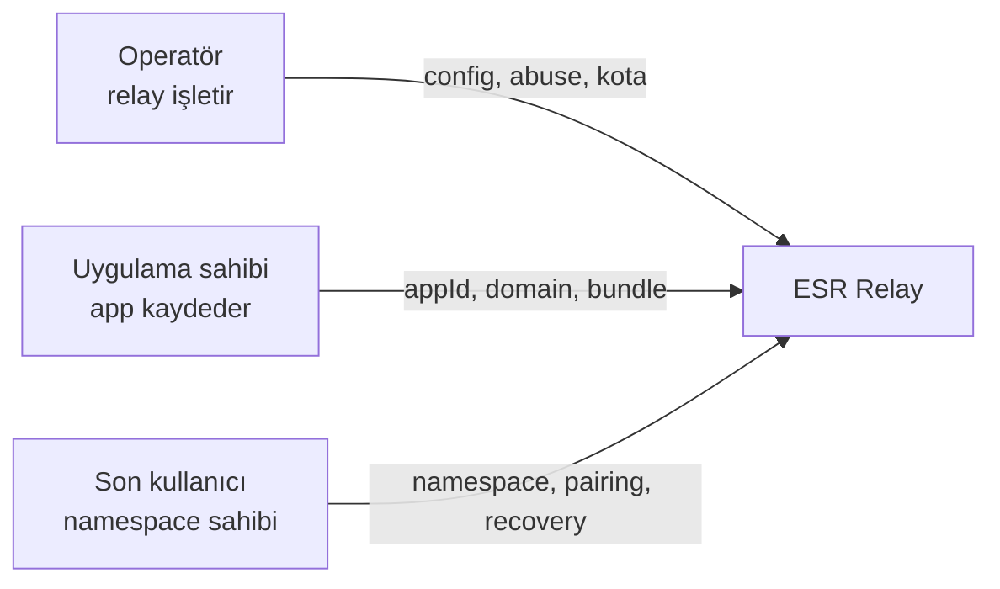
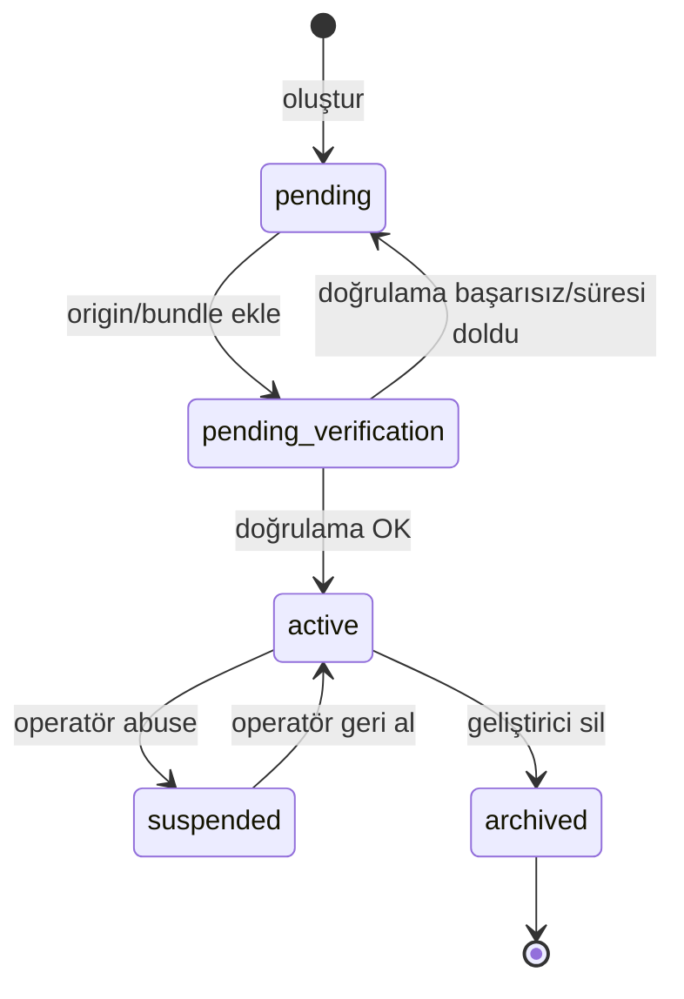

# 16 — Uygulama Kaydı (App Registry) ve Namespace Bağlama

| Alan | Değer |
|------|--------|
| Durum | **Spec v1.3 — planlandı** |
| Hedef spec sürümü | **1.3.0** |
| Üzerine inşa | REST MVP (v1.0), WebSocket (v1.1), çoklu belge (v1.2) |
| API prefix | `/v1` (değişmedi; ek uçlar) |
| Protokol magic | `ESR-DOC1` (değişmedi) |

> **English:** [../en/16-APP-REGISTRY.md](../en/16-APP-REGISTRY.md)

---

## 1. Özet

Spec **v1.3**, mevcut cihaz token kimlik doğrulama modelinin **üstüne** isteğe bağlı bir **Uygulama Kaydı (Application Registry)** katmanı getirir. Kayıtlı her uygulama (`appId`) bir tüketici entegrasyonunu temsil eder (web SPA, iOS, Android). Özellik açıkken **namespace'ler tam olarak bir uygulamaya bağlıdır**.

Operatör, uygulamaların nasıl kaydedileceğini config ile seçer:

| Mod | Uygulamayı kim kaydeder |
|-----|-------------------------|
| `disabled` | Özellik kapalı — v1.2 davranışı korunur |
| `operator_managed` | Yalnızca operatör (YAML seed + admin API) |
| `self_service` | Uygulama sahipleri — geliştirici portalı + otomatik domain/bundle doğrulama |

**Güvenlik sınırı:**

- **Uygulama kimlik bilgileri** → *“Bu relay'i hangi entegrasyon kullanabilir?”*
- **Cihaz token + pairing/recovery** → *“Bu cihaz hangi kullanıcı workspace'ine erişebilir?”*

Uygulama kaydı **mevcut namespace'lere erişim vermez**. Veri erişimi pairing/recovery ile korunur; E2EE değişmez.

**Kapsam dışı (v1.3):**

- Senkron verisi için son kullanıcı hesabı (Alice'in “Senkronla girişi” yok)
- Namespace sahipleri için OAuth / sosyal giriş
- Relay'ler arası uygulama federasyonu
- `file://` origin desteği (kapsam dışı; bkz. §8.4)

---

## 2. Motivasyon

| Sorun | v1.2 davranışı | v1.3 çözümü |
|-------|----------------|-------------|
| Bilinmeyen istemciler public relay'i kötüye kullanır | Yalnızca IP rate limit | App başına kota + askıya alma |
| Operatör her entegrasyonu elle whitelist'ler | Statik CORS listesi | Doğrulanmış origin'lerden dinamik CORS |
| Entegrasyon başına audit yok | Loglarda yalnızca namespaceId | namespace, cihaz, isteklerde `appId` |
| Hosted platform geliştirici onboarding ister | Operatör YAML yazar | Self-service portal + DNS doğrulama |
| Pairing kodunu sunan her istemci | Yalnızca kod | Pairing token'da isteğe bağlı `allowedAppIds` |

---

## 3. Roller



| Rol | Açıklama | Ne kaydeder |
|-----|----------|-------------|
| **Operatör** | Relay deployment sahibi, config, admin token | Platform politikası; `operator_managed` modunda uygulamalar |
| **Uygulama sahibi (geliştirici)** | MyNotes, TodoApp vb. geliştirir | `self_service` modunda app + origin/bundle |
| **Son kullanıcı** | Alice workspace senkronlar | Uygulama istemcisi üzerinden namespace — **app kaydı değil** |

---

## 4. Tasarım ilkeleri

1. **Config ile opt-in** — `apps.enabled: false` tam v1.2 uyumluluğu.
2. **Katmanlı auth** — App kapısı ek katman; cihaz token semantiği aynı.
3. **Namespace tek app'e ait** — Özellik açıkken her namespace'in `app_uuid` değeri vardır; cross-app API erişimi reddedilir.
4. **Web güveni = Origin + public appId** — Tarayıcı SPA için client secret yok (Firebase/OAuth public client modeli).
5. **Native güveni = bundle/package (+ opsiyonel secret veya attestation)** — Native HTTP'de Origin header yok.
6. **Domain sahipliği otomatik** — Self-service DNS TXT veya HTTPS well-known zorunlu; operatör manuel onay yedek.
7. **Zero-knowledge korunur** — App katmanı yalnızca metadata görür; envelope kuralları değişmez.

---

## 5. Yapılandırma

### 5.1 Tam şema

```yaml
apps:
  # Ana anahtar. false = v1.2 (app kontrolü yok, app_uuid'siz namespace'ler).
  enabled: false

  # Uygulamalar nasıl kaydedilir (enabled: false iken yok sayılır).
  registrationMode: operator_managed   # operator_managed | self_service

  # Geçerli app kimlik bilgisi olmayan istekleri reddet (enabled: true iken).
  requireRegistration: true

  # Geliştirme kolaylığı — production'da asla true.
  allowLocalhostOrigins: false

  # Migrasyon: mevcut namespace'leri (app_uuid IS NULL) okuma/yazmada bu app'e ata.
  legacyDefaultAppId: null

  verification:
    dnsRecordPrefix: "_esr-verify"
    wellKnownPath: "/.well-known/esr-app-verification"
    challengeTtlSeconds: 86400
    fetchTimeoutSeconds: 10

  limits:
    perApp:
      namespacesPerDay: 100
      pairingTokensPerHour: 30
      recoverPerHour: 5
    perDeveloper:
      maxApps: 10                          # yalnızca self_service

  native:
    requireClientSecret: false
    requireManualReview: true

  developerPortal:
    enabled: false                         # registrationMode: self_service iken otomatik true
    jwtSecret: "${ESR_DEVELOPER_JWT_SECRET}"
    sessionTtlHours: 168
    requireEmailVerification: true

  # operator_managed: startup'ta seed (DB ile birleşir; çakışmada DB kazanır).
  seed:
    - appId: esr_app_internal
      name: Dahili Web Uygulaması
      type: web
      status: active
      origins:
        - https://app.example.com
    - appId: esr_app_mobile
      name: Mobil İstemci
      type: native
      status: active
      bundleIds:
        ios: com.example.app
        android: com.example.app
      clientSecretHash: null
```

### 5.2 Ortam değişkenleri

```bash
ESR_APPS__ENABLED=true
ESR_APPS__REGISTRATION_MODE=self_service
ESR_APPS__REQUIRE_REGISTRATION=true
ESR_APPS__ALLOW_LOCALHOST_ORIGINS=false
ESR_APPS__DEVELOPER_PORTAL__JWT_SECRET=change-me-long-random
```

### 5.3 Mod matrisi

| `enabled` | `registrationMode` | Davranış |
|-----------|-------------------|----------|
| `false` | herhangi | v1.2 — `X-ESR-App-Id` yok, app bağsız namespace |
| `true` | `operator_managed` | Operatör YAML + `POST /v1/admin/apps`; geliştirici portalı yok |
| `true` | `self_service` | Geliştirici portalı + DNS/bundle doğrulama; admin yalnızca suspend |

`enabled: true` ve `requireRegistration: true` iken:

- Tüm public ve cihaz-auth uçları geçerli app bağlamı ister (§7).
- `POST /v1/namespaces` namespace'i **istek yapan app'e bağlar**.
- Başka app'in namespace'ine ait cihaz token → `403 APP_NAMESPACE_MISMATCH`.

---

## 6. Uygulama modeli

### 6.1 App tipleri

| type | Kimlik sinyali | Doğrulama |
|------|----------------|-----------|
| `web` | `Origin` header (tam eşleşme) | DNS TXT veya HTTPS well-known |
| `native` | `X-ESR-Bundle-Id` + `X-ESR-Platform: ios\|android` | Manuel inceleme ve/veya client secret; gelecekte attestation |

### 6.2 Public tanımlayıcılar

| Alan | Format | Gizli mi? |
|------|--------|-----------|
| `appId` | `esr_app_` + 12 char base32 | **Hayır** — SDK'da gömülü |
| `clientSecret` | rastgele 32+ byte | **Evet** — yalnızca native confidential; hash saklanır |

Web SPA **client secret kullanmamalı** (HTML/bundle'dan çıkarılabilir).

### 6.3 App durum makinesi



| status | API erişimi |
|--------|-------------|
| `pending` | Hayır — kayıt tamamlanmadı |
| `pending_verification` | Hayır — DNS/HTTPS/manuel inceleme bekliyor |
| `active` | Evet |
| `suspended` | Hayır — `403 APP_SUSPENDED` |
| `archived` | Hayır — soft delete |

---

## 7. İstek kimlik doğrulama

### 7.1 Zorunlu header'lar (`apps.enabled` + `requireRegistration`)

| Header | Zorunlu | Açıklama |
|--------|---------|----------|
| `X-ESR-App-Id` | Her zaman | Public app tanımlayıcı |
| `Origin` | Web | Tarayıcı gönderir; kayıtlı origin ile eşleşmeli |
| `X-ESR-Platform` | Native | `ios` veya `android` |
| `X-ESR-Bundle-Id` | Native | Bundle ID (iOS) veya package name (Android) |
| `X-ESR-Client-Secret` | Native confidential | `native.requireClientSecret: true` iken |
| `Authorization` | Cihaz uçları | Mevcut `Bearer {device_token}` |

### 7.2 Doğrulama algoritması

```
function validateAppContext(request):
  if !config.apps.enabled:
    return OK

  appId = header X-ESR-App-Id
  if missing: reject APP_ID_REQUIRED

  app = db.apps.findByAppId(appId)
  if !app: reject APP_NOT_FOUND
  if app.status != active: reject APP_SUSPENDED | APP_NOT_VERIFIED

  if app.type == web:
    origin = header Origin ?? parseRefererOrigin(Referer)
    if !origin: reject APP_ORIGIN_REQUIRED
    if config.apps.allowLocalhostOrigins && isLocalhost(origin):
      pass
    else if origin not in app.verified_origins:
      reject APP_ORIGIN_NOT_ALLOWED

  if app.type == native:
    platform = header X-ESR-Platform
    bundleId = header X-ESR-Bundle-Id
    if !platform || !bundleId: reject APP_NATIVE_ID_REQUIRED
    if !app.bundle_ids.matches(platform, bundleId):
      reject APP_BUNDLE_NOT_ALLOWED
    if config.apps.native.requireClientSecret:
      secret = header X-ESR-Client-Secret
      if !constantTimeEquals(hash(secret), app.client_secret_hash):
        reject APP_CLIENT_SECRET_INVALID

  attach request.appContext = app
  return OK
```

### 7.3 Cihaz token çapraz kontrolü

Cihaz auth middleware sonrası:

```
if config.apps.enabled:
  namespace = request.namespace
  if namespace.app_uuid != request.appContext.uuid:
    reject 403 APP_NAMESPACE_MISMATCH
```

### 7.4 Endpoint matrisi

| Endpoint | App bağlamı | Cihaz token | Not |
|----------|-------------|-------------|-----|
| `POST /v1/namespaces` | Zorunlu | — | `namespace.app_uuid` set eder |
| `POST /v1/namespaces/.../devices` | Zorunlu | — | Pairing redeem |
| `POST /v1/namespaces/.../recover` | Zorunlu | — | Recovery |
| `POST /v1/namespaces/.../pairing-tokens` | Zorunlu | Evet | Body'de opsiyonel `allowedAppIds` |
| Sync (`head`, `push`, `pull`) | Zorunlu | Evet | |
| WebSocket `/notifications` | Zorunlu (Origin) | Evet | Handshake |
| `GET /health` | Hayır | — | |
| Admin `/v1/admin/*` | Hayır | Admin token | |
| Developer `/v1/developer/*` | Developer JWT | — | yalnızca self_service |

### 7.5 Pairing kapsamı (opsiyonel)

Host hangi app'lerin kodu kullanabileceğini kısıtlayabilir:

```json
POST /v1/namespaces/{namespaceId}/pairing-tokens
{
  "ttlSeconds": 600,
  "allowedAppIds": ["esr_app_mynotes", "esr_app_mynotes_mobile"]
}
```

Listede olmayan `X-ESR-App-Id` ile redeem → `403 APP_PAIRING_NOT_ALLOWED`.

Varsayılan (alan yok): her **active** app redeem edebilir.

---

## 8. Origin ve domain doğrulama

### 8.1 Tam origin kuralları

Kayıtlı origin'ler **scheme ve port dahil** tam origin'dir:

```
https://app.example.com
https://app.example.com:8443
http://localhost:5173
http://127.0.0.1:3000
```

- Wildcard yok (`*.example.com` yasak).
- `https` ve `http` farklıdır.

### 8.2 DNS TXT doğrulama

```
_esr-verify.notes.example.com  TXT  esr_verify=esr_app_abc123:<random_token>
```

### 8.3 HTTPS well-known doğrulama

```
GET https://notes.example.com/.well-known/esr-app-verification
```

```json
{
  "appId": "esr_app_abc123",
  "token": "<aynı random token>"
}
```

### 8.4 Localhost geliştirme

`allowLocalhostOrigins: true` iken:

- `http://localhost:*` ve `http://127.0.0.1:*` DNS doğrulaması olmadan kabul edilir.
- Öneri: ayrı dev app (`esr_app_mynotes_dev`).
- Production'da `allowLocalhostOrigins: false` (true ise startup uyarısı).

### 8.5 `file://` (desteklenmiyor)

App registry açıkken Origin olmayan non-native istekler reddedilir. Statik `file://` sayfalar doğrulanabilir origin kaydedemez. Bunun yerine local dev server kullanın (`http://localhost:5173`).

---

## 9. Native uygulamalar (iOS / Android)

Native HTTP istemcileri güvenilir `Origin` göndermez. `type: native` kayıt kullanın.

### 9.1 Header'lar

```http
X-ESR-App-Id: esr_app_mynotes_mobile
X-ESR-Platform: ios
X-ESR-Bundle-Id: com.example.mynotes
Authorization: Bearer dvt_...
```

### 9.2 Doğrulama katmanları

| Katman | Mekanizma | Sahteciliğe dayanıklılık |
|--------|-----------|--------------------------|
| **A — Operatör yönetimli** | Operatör bundle ID ekler | Düşük (curl ile header spoof) |
| **B — Confidential client** | Auth'suz uçlarda `X-ESR-Client-Secret` | Orta (Keychain/Keystore) |
| **C — Attestation (gelecek v1.4)** | App Attest / Play Integrity | Yüksek |

Katman A private self-hosted için yeterli. Public hosted relay için Katman B önerilir.

### 9.3 Self-service native akışı

1. Geliştirici `type: native` app oluşturur.
2. iOS bundle ID ve/veya Android package ekler.
3. `requireManualReview: true` ise operatör onayına kadar `pending_verification`.
4. `active` → native header'lar kabul edilir.

### 9.4 SDK connect seçenekleri

```typescript
await EsrSync.connect({
  relayUrl: 'https://sync.example.com',
  appId: 'esr_app_mynotes_mobile',
  appPlatform: 'ios',
  bundleId: 'com.example.mynotes',
  clientSecret: process.env.ESR_CLIENT_SECRET,
})
```

---

## 10. Namespace bağlama

### 10.1 Kural

`apps.enabled: true` iken:

- Her namespace satırında null olmayan `app_uuid` FK → `apps.id`.
- `(namespace_id)` global unique kalır (UUID v4).
- Mantıksal izolasyon: app `A` ile oluşturulan namespace yalnızca `A` app bağlamıyla erişilebilir.

Aynı kişi iki app kullanırsa → iki bağımsız namespace evreni (farklı `namespaceId`).

### 10.2 Namespace oluşturma (güncellenmiş)

```http
POST /v1/namespaces
X-ESR-App-Id: esr_app_mynotes
Origin: https://notes.example.com
```

Body v1.2 ile aynı. Yanıta eklenen:

```json
{
  "namespaceId": "...",
  "appId": "esr_app_mynotes",
  "deviceToken": "...",
  ...
}
```

### 10.3 Recovery

Recovery, namespace'in app'i ile eşleşen app bağlamı gerektirir. Yanlış app → `403 APP_NAMESPACE_MISMATCH`.

### 10.4 App'ler arası migrasyon

**v1.3'te desteklenmez.** Namespace'i app'ler arası taşımak operatör aracı gerektirir — kapsam dışı.

---

## 11. Dinamik CORS

`apps.enabled: true` iken statik `cors.allowedOrigins` yalnızca fallback:

- Doğrulanmış origin'lerden dinamik allow list
- WebSocket handshake aynı Origin kuralı

---

## 12. Geliştirici portalı (self_service)

`registrationMode: self_service` iken etkin.

### 12.1 Geliştirici hesabı

Senkron son kullanıcı kimliğinden ayrı. E-posta, şifre hash, doğrulama durumu.

Geliştirici entegrasyonu kaydeder; Alice uygulamayı kullanır — geliştirici hesabı açmaz.

### 12.2 API yüzeyi

Base: `/v1/developer`

| Method | Path | Auth | Açıklama |
|--------|------|------|----------|
| POST | `/register` | — | Geliştirici hesabı |
| POST | `/login` | — | JWT oturum |
| POST | `/logout` | JWT | Oturum kapat |
| GET | `/me` | JWT | Profil |
| POST | `/apps` | JWT | App oluştur |
| GET | `/apps` | JWT | Kendi app'lerini listele |
| GET | `/apps/:appId` | JWT | Detay |
| PATCH | `/apps/:appId` | JWT | İsim güncelle |
| POST | `/apps/:appId/origins` | JWT | Web origin ekle |
| POST | `/apps/:appId/origins/:originId/verify` | JWT | DNS/HTTPS kontrolü |
| DELETE | `/apps/:appId/origins/:originId` | JWT | Origin kaldır |
| POST | `/apps/:appId/bundles` | JWT | Bundle ekle |
| DELETE | `/apps/:appId` | JWT | App arşivle |
| POST | `/apps/:appId/rotate-secret` | JWT | Native secret rotate |

Admin API (`/v1/admin/apps`): suspend, kota override, native manuel onay.

---

## 13. Operatör admin API

Base: `/v1/admin/apps` — `admin_api_token` gerekir.

CRUD, doğrudan origin ekleme, native bundle onayı, arşivleme.

---

## 14. Veri modeli

### 14.1 ER diyagramı (eklemeler)

Yeni tablolar: `developers`, `apps`, `app_origins`, `app_bundles`.

`namespaces.app_uuid` → `apps.id` FK.

`apps.enabled: false` iken `namespaces.app_uuid` nullable.

### 14.2 Migrasyon `006_app_registry.sql`

Tam DDL için [EN sürüm §14.2](../en/16-APP-REGISTRY.md#142-migration-006_app_registrysql-reference).

### 14.3 Pairing token

`allowed_app_ids`: nullable text array. NULL = kısıt yok.

---

## 15. Rate limit ve kotalar

Yeni scope'lar:

| action id | Kapsam |
|-----------|--------|
| `namespace_create` | app_id + IP |
| `pairing_token` | app_id |

App kotası aşımı → `429 RATE_LIMIT_EXCEEDED`, `details.appId`.

---

## 16. Güvenlik

### 16.1 Ek tehdit modeli

| Tehdit | Önlem |
|--------|-------|
| Kayıtsız istemci spam | `requireRegistration` + app kotası |
| Registry'de domain hijack | DNS/HTTPS doğrulama |
| curl ile Origin spoof | Tarayıcı kullanıcıları için irrelevant; non-browser rate limit |
| Çalıntı appId | Domain/bundle eşleşmesi olmadan web için işe yaramaz |
| Cross-app namespace probe | Uniform `APP_NAMESPACE_MISMATCH` |

### 16.2 App registry'nin korumadığı alanlar

- Payload gizliliği (E2EE + zero-knowledge)
- Yetkisiz namespace erişimi (pairing/recovery)
- Operatör metadata görünürlüğü

---

## 17. Hata kodları (yeni)

| HTTP | code | Açıklama |
|------|------|----------|
| 400 | APP_ID_REQUIRED | `X-ESR-App-Id` eksik |
| 400 | APP_ORIGIN_REQUIRED | Web isteğinde Origin yok |
| 400 | APP_NATIVE_ID_REQUIRED | Native header eksik |
| 401 | APP_CLIENT_SECRET_INVALID | Yanlış native secret |
| 403 | APP_NOT_FOUND | Bilinmeyen appId |
| 403 | APP_NOT_VERIFIED | App henüz active değil |
| 403 | APP_SUSPENDED | Operatör askıya aldı |
| 403 | APP_ORIGIN_NOT_ALLOWED | Origin kayıtlı değil |
| 403 | APP_BUNDLE_NOT_ALLOWED | Bundle/package uyuşmuyor |
| 403 | APP_NAMESPACE_MISMATCH | Namespace başka app'e ait |
| 403 | APP_PAIRING_NOT_ALLOWED | allowedAppIds dışında |
| 409 | APP_ORIGIN_EXISTS | Duplicate origin |
| 409 | APP_BUNDLE_EXISTS | Duplicate bundle |

Tam liste: [12-ERROR-CODES.md](./12-ERROR-CODES.md).

---

## 18. SDK değişiklikleri

```typescript
interface EsrSyncOptions {
  relayUrl: string
  appId?: string
  appPlatform?: 'web' | 'ios' | 'android'
  bundleId?: string
  clientSecret?: string
  clientVersion?: string
}
```

| Relay config | appId'siz eski SDK |
|--------------|-------------------|
| `apps.enabled: false` | Çalışır |
| `apps.enabled: true` | `APP_ID_REQUIRED` — SDK güncellemesi gerekir |

---

## 19. v1.2'den migrasyon

1. `apps.enabled: false` ile v1.3 deploy — davranış değişmez.
2. Seed app'ler oluştur.
3. `legacyDefaultAppId` set et.
4. `UPDATE namespaces SET app_uuid = ... WHERE app_uuid IS NULL`.
5. `apps.enabled: true` aç.
6. SDK'da zorunlu `appId` yayınla.
7. Migrasyon sonrası `legacyDefaultAppId` kaldır.

### Self-hosted önerilen varsayılan

```yaml
apps:
  enabled: true
  registrationMode: operator_managed
  requireRegistration: true
  allowLocalhostOrigins: false
  seed:
    - appId: esr_app_primary
      name: Kuruluş Uygulamaları
      type: web
      status: active
      origins:
        - https://app.example.com
```

---

## 20. Uygulama planı

### Faz A — Çekirdek registry (5–7 gün)

Migrasyon, config, middleware, namespace bağlama, dinamik CORS, SDK header'ları.

### Faz B — Operatör admin API (2–3 gün)

`/v1/admin/apps` CRUD, suspend, seed merge.

### Faz C — Domain doğrulama (3–4 gün)

DNS TXT + HTTPS well-known, localhost dev yolu.

### Faz D — Geliştirici portalı (5–7 gün)

JWT auth, self-service CRUD, e-posta doğrulama.

### Faz E — Native + pairing scope (3–4 gün)

Bundle kayıt, client secret, `allowedAppIds`, WS Origin.

### Faz F — Dokümantasyon ve OpenAPI (2 gün)

Agent docs, OPERATOR.md, Postman.

---

## 21. Kabul kriterleri

- [ ] `apps.enabled: false` — tüm v1.2 testleri geçer
- [ ] `operator_managed` — eşleşen origin ile sync çalışır
- [ ] Yanlış origin → `403 APP_ORIGIN_NOT_ALLOWED`
- [ ] App A namespace'i app B ile erişilemez
- [ ] `self_service` — operatör olmadan domain verify → active
- [ ] Localhost dev `allowLocalhostOrigins: true` ile çalışır
- [ ] `allowedAppIds` pairing kısıtı çalışır
- [ ] Dinamik CORS yalnızca doğrulanmış origin'ler
- [ ] Web SDK'da client secret yok
- [ ] Legacy namespace migrasyonu `legacyDefaultAppId` ile

---

## 22. İlgili belgeler

| Belge | Güncelleme |
|-------|------------|
| [04-API-REFERENCE.md](./04-API-REFERENCE.md) | App header'ları, yeni uçlar |
| [07-SERVER-CONFIGURATION.md](./07-SERVER-CONFIGURATION.md) | `apps` config |
| [08-SECURITY.md](./08-SECURITY.md) | App tehdit modeli |
| [10-DATA-MODEL.md](./10-DATA-MODEL.md) | Yeni tablolar |
| [11-IMPLEMENTATION-PLAN.md](./11-IMPLEMENTATION-PLAN.md) | Faz A–F |
| [12-ERROR-CODES.md](./12-ERROR-CODES.md) | App hata kodları |
| [14-ESR-SYNC-FACADE.md](./14-ESR-SYNC-FACADE.md) | `appId` connect |

---

## 23. Sürüm geçmişi

| Sürüm | Değişiklik |
|-------|------------|
| **1.3.0** | App registry, namespace–app bağlama, operator/self-service modları |
| 1.2.0 | Namespace başına çoklu belge |
| 1.1.0 | WebSocket bildirimleri |
| 1.0.x | İlk ESR MVP |
